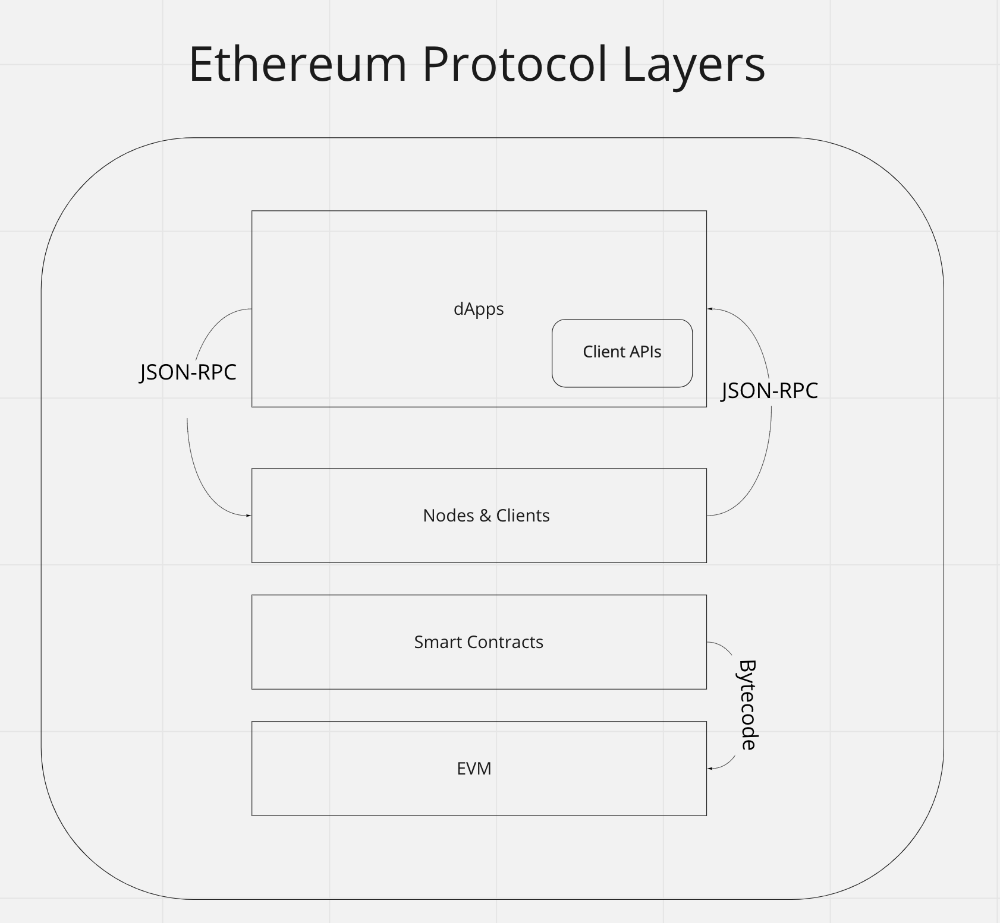
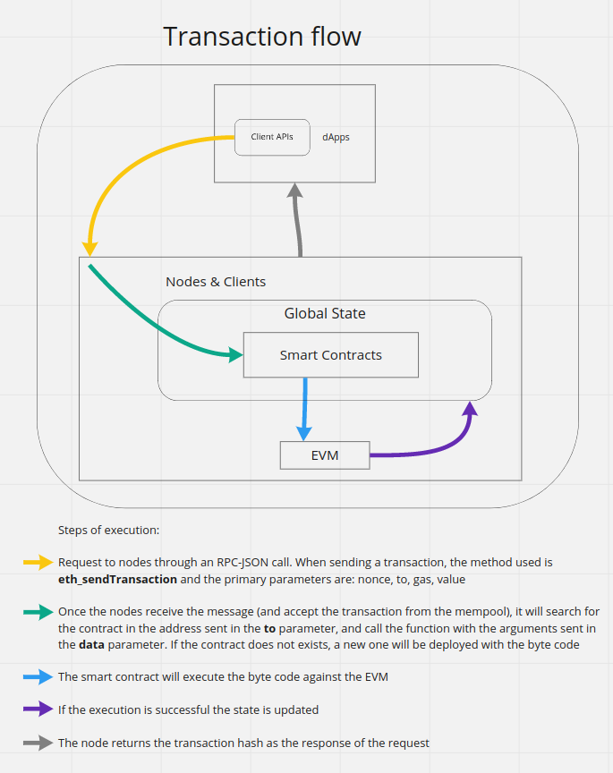

# Ethereum architecture

As in any complex software, the Ethereum Protocol is divided into different layers. In the Ethereum [documentation](https://ethereum.org/en/developers/docs/ethereum-stack/) we can see an overview of the different pieces of the stack.

- Decentralized Applications (dApps)
- Client APIs
- Nodes & Clients
- Smart Contracts
- EVM

<p float="center">
  
</p>

## dApps

Decentralized Applications are the User Interface of Ethereum. You can see it as the way to interact with it in a friendly way.

The main difference with traditional apps is that dApps interact with Ethereum through [JSON-RPC](https://ethereum.org/en/developers/docs/apis/json-rpc/) requests, instead of a backend server through HTTP requests or WebSocket connection.

- Client APIs: Libraries that allow interaction with Ethereum in different programing languages by implementing the [different methods](https://playground.open-rpc.org/?schemaUrl=https://raw.githubusercontent.com/ethereum/eth1.0-apis/assembled-spec/openrpc.json&uiSchema%5BappBar%5D%5Bui:splitView%5D=true&uiSchema%5BappBar%5D%5Bui:input%5D=false&uiSchema%5BappBar%5D%5Bui:examplesDropdown%5D=false)

## Nodes & Clients

According to [ethereum.org](https://ethereum.org/en/developers/docs/nodes-and-clients/#what-are-nodes-and-clients)

```
"Node" refers to a running piece of client software. A client is an implementation of Ethereum that verifies all transactions in each block, keeping the network secure and the data accurate."
```

Nodes are the core of Ethereum network, making it 100% decentralized, they are software running all over the world; they can mine blocks and verify data.

**Consensus**

A consensus algorithm has been implemented so the nodes can interact between them in a secure way, guaranteeing that the network is robust enough to handle malicious actors. The incentive for a node to be honest is that, if they mine a block they will be rewarded by the network.

Currently, Eth 1.0 uses Proof of Work as the consensus algorithm, meaning that nodes that wants to be miners needs to have the entire history of Ethereum stored. Meaning that, when a new block is mined, **all** the nodes are updated with the new information. This (between a lot of more reasons) makes the Proof of Work consensus not the best option if we want Ethereum to be scalable. With Serenity (Eth 2.0) this problem will be solved with Casper (PoS) & Sharding.

// TODO: Explain Casper and Sharding

**MEV** (Miner Extractable Value)

When a miner gets the nonce to produce a new block into the chain, it has the ability to reorder the transactions (This also happens in PoS).
This allow the miner to arbitrarily reorder transactions, insert its own transactions before or after other transactions, and delay transactions outright until the next block, and it turns out that there are a lot of ways that one can earn money from this; hence, making it a consensus-layer risk

## Smart Contracts (SC)

Script or a program that is written in a high level programming languages that allows the implementation of complex logic that can be executed against the EVM - You can see it as open source libraries that lives forever in Ethereum, giving the capacity to interact with that code once the SC has been deployed. The compilers (from `solidity` or `vyper`) convert the high level language into `bytecode` and then it is stored in the Global State.

Smart contracts are stored in the global state with four parameters:
- Nonce
- Balance
- Storage Hash (which maps to account storage)
- Code Hash (which maps to EVM code)

## EVM (Ethereum Virtual Machine)

Is a lightweight virtual machine that runs in every node validating and executing transactions - The purpose of it is that it can run anywhere without depending on any hardware or operating system. It cannot access network, file system or other processes of the operating system; acting as an independent sandbox. But it can access to the global state and has his own memory at runtime (you can see it as a RAM).


## Ethereum transaction flow

<p float="center">
  
</p>