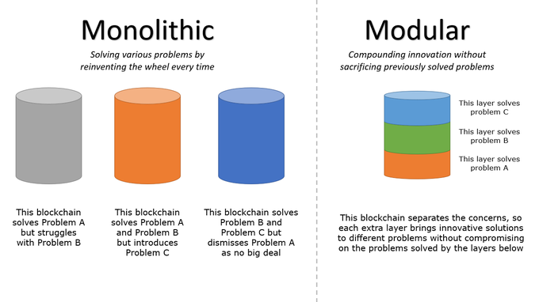

# Roadmap for Ethereum upgrades

_**Note**: This is a long-term roadmap. Changes may be applied as the protocol evolves_ 

## Merge: PoW dies

Complete transition to PoS. The specs are done, not only how it's going to work but also how the change will be. Kintsugi is the dev net of the merge. A few bugs have been discovered, so dev teams are building "more armor" for this update. Once the post-merge fork happens, validators can start the withdraw of ETH.

The merge is going to be executed in two hard forks, being the first the one that eliminates PoW, hence, no more issuance by miners. Application developers won't have to update their code.

## Surge: Scalability

Scalability increases for rollups through sharding. Rollups are layer two scaling solutions. The way they work is that computation & storage go off the chain, but data stays on the chain; this allows transactions to happen much more cheaply than L1, but it inherits the security implications from L1.

Rollups will be the ones that interpret and execute the available data. It doesn't have to figure out data availability or consensus, and it just takes care of execution. Bundle different transactions compress everything to the smallest size it and then it sends it to mainnet. First, it will start with basic sharding, which means that only 32 shards will be distributed per node, then more shards will be added. According to Vitalik's [scaling](https://vitalik.ca/general/2021/05/23/scaling.html) article:

```
Ethereum is planning to use quadratic sharding, where total scalability is limited by the fact that a node has to be able to process both a single shard and the beacon chain, which has to perform some fixed amount of management work for each shard. If shards are too big, nodes can no longer process individual shards, and if there are too many shards, nodes can no longer process the beacon chain. The product of these two constraints forms the upper bound.
```

Meaning that we don't know yet what's the number of shards that will be added in the future.

## Verge: Stateless clients

Verge introduces Verkle trees, which replace Patricia Merkle trees (currently how the global state is stored in Ethereum.) The main problem with Patricia Merkle trees is that currently, if you want to query the information of N block, you need to do it to a node that is full synced (meaning that the node has the entire history of the chain stored locally), making it more difficult to achieve real node decentralization, because fully synced nodes are hard to set up. 

With the Verkle trees, the stateless clients are introduced. The main point of those is that the client can fetch the data from a specific block just by querying it with the proof of that block. This means that it can guarantee that the information is valid, and the node does not need to have the entire history of the chain stored locally.

This is useful because validators will be a lot more lightweight. They will only verify blocks that they need to verify in real-time - It is more scalable, faster, and much easier to set up.

## Purge: Eliminating historical data

We stop requiring the nodes to store the entire history of the blockchain, and the idea is that they will only need one year of data. The idea behind this is that there are going to be multiple services (Like block explorers, portal network, the graph, among others - Being portal network the most decentralized solution nowadays) that will allow us to get the information older than a year ago by using the Verkle trees. 

This means that the Data Availability will be moved into different protocols & remove a lot of the complexity of the Ethereum implementations (clients).

# Benefits of these upgrades

Currently, Ethereum is a monolithic blockchain, meaning that it tries to do everything at the same stop. The main objective of these upgrades is to make Ethereum a modular blockchain; this means making the following layers composable:

- Consensus: Defines how the blocks are validated into the chain; this basically defines what is true to add it to the chain's history. Currently, the algorithm used is Proof of Work (Ethash) and will be moved to Proof of Stake (Casper).

- Execution: It's the computation needed to execute the operations requested through transactions. With rollups, the execution will be moved to layer two solutions.

- Data Availability: Give the blockchain the capability to access the history. This needs to be reliable in order to guarantee that the data will always be available to anyone who wants to access it.

<p float="center">
  
</p>

_Thanks to [@domothy](https://twitter.com/domothy/status/1472619285566664708) for this resource_

Keeping in mind the [Scalability trilemma](https://aakash-111.medium.com/the-scalability-trilemma-in-blockchain-75fb57f646df), Ethereum developers had to make a decision and went with the architecture of the protocol to be decentralized and secure but not _that_ scalable. With these changes, we aim to make Ethereum scalable, making easier the mass adoption (Anyone can run a node in a super-easy way) and cheaper by moving the computation to layer two solutions.
