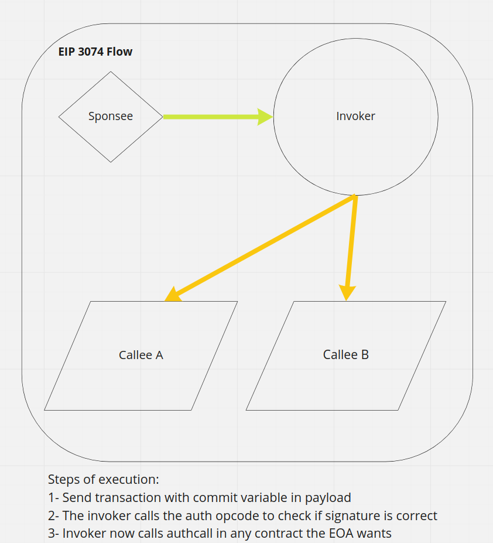

# Account Migration

### Introduction

Ethereum has two types of accounts: The external owner accounts (EOAs) and contract accounts.

EOAs have a private key: Having the private key means control over access to funds. In fact, the EOAs are the only type of accounts that can initiate a transaction in Ethereum, and the reason is that in order to send a transaction, the account needs to sign it with a private key. Currently, Ethereum uses ECDSA (Elliptic Curve Cryptographic Signature Algorithm) to sign the transactions.

Contract Accounts have arbitrary code associated to them and are owned and controlled by the logic of such code. This code is stored in the Ethereum blockchain at the contract account's creation address and is executed by the EVM.

The main difference between EOAs and Contract Accounts is that EOAs do not have code associated with them, and Contract Accounts are not associated with any private key.

## EIP 3074

**Cool use cases**

- Paying for gas with tokens: Using non-eth assets to pay for gas
- Automated gas pricing: Resubmitting transactions with optimal gas price
- Subsidized dApps
- Off-Chain fee payments

Currently, we can not fake msg.sender natively.

It aims to give an EOAs the capacity to provide total control of his account to an invoker. The invoker is the contract that must be trusted, and it can do whatever it wants once it has the signature of an account. It needs to be secured and audited.

**Definitions**

EOA:
- Sponsor: Pays for gas & submits the transaction
- Sponsee: Wants to get a transaction on-chain

Contracts
- Invoker: Uses the `AUTH` & `AUTHCALL` instruction
- Callee: Contract to interact with from the invoker

### Notes
- If you want to send ether in EIP3074 it needs to be from the *invoker*
- Chain ID is important because the invoker should check it to make sure it matches correctly with the one sent in the payload of the transaction
- Trust an invoker means that the EOA will need to make sure that it works properly. For example, the invoker should be able to handle replay protection correctly, and the EOA will need to check that this invoker indeed does that
- People usually do not check these things, and this is a double edge sword - The main difference is that here you are giving total control of your account
- It can be dangerous if it's not used in the correct way, but it allows a lot of flexibility. If we want to achieve mass adoption of Ethereum, we will want to implement these Account Experience improvements
- Allows you to pass the `msg.sender` through different jumps (or calls).
- Further downs the two type accounts
- You can batch transactions. The invoker would need to make multiple authcalls using the same commit
- Only new opcodes will be introduced (`AUTH` and `AUTHCALL`), which is less intrusive than creating a new transaction type 

### Implementation details

- `AUTH` and `AUTHCALL` opcodes will be introduced
- Add a new precompile contract 

  

## EIP 2938

**Cool uses cases**

- Smart Contract Wallet: On-chain contract that provides additional features
- Mixer: Anonymizes funds by pooling many deposits into a pool. Today, relayer pays for gas & is reimbursed, with eip 2938, the fees are deducted directly from the withdrawal
- In-App tokens: dApp has its own token which entitles users to pay for gas 

### Notes

Allows a contract to be the top-level account that pays fees and start transaction execution
- Reduces client complexity - Account abstraction removes EOA. Authorization logic will be moved to Smart Contract execution layer
- If a new user wants to create a new wallet, he needs to pay for the deployment of the AA contract

With this EIP we want to add multiple improvements, some of them are:
  - Support signature verification other than ECSDA, which allows making Ethereum post-quantum resistant
  - Batch transactions
  - Gasless transactions

To implement AA, we require merging EIP 2937 or preserving nonce on self destruct

- Two categories: Single-tenant and Multi-tenants.
    - Single-tenant is for wallet and an account per user case. 
    - Multi-tenants will aim to account for many users, like tornado cash or uniswap. AA support for multi-tenant applications requires more research and is proposed as future work; so first, single-tenant is the only one that's going to be developed
- Remove the necessity of relayers. You would just need to relay on the clients, since the contract takes care of paying for the gas
- This EIP adds extensive changes to the protocol; it's a must that new mempool rules are added, every client implements it exactly the same way, and they need to make sure that everyone behaves exactly the same

### Implementation details

- `NONCE` and `PAYGAS` opcodes will be introduced
- Changes to mempool rules
- A new type of transaction would be added. They are called "AA transactions" and the payload should be `rlp([nonce, target, data])`

  The transaction would consist on two processes:

  1. Authentication: the process where the caller can indeed call this contract. This will happen in an isolated environment, throwing if the authentication process tries to access memory, or write storage. This process should be a pure function, or only interact with precompiled contracts.
  2. Execution: The opcode `PAYGAS` will be triggered at first and will calculate the gas price and gas limit for the transaction. Note that if the transaction fails, the contract will not be refunded.

## Differences
  - Introducing a new transaction type means new mem pools rules need to be implemented. We need to be careful with this because it can cause service vector or additional processing
  - Introducing a new opcode is easier and less intrusive than adding a new transaction type
  - 

### Resources

- https://blog.ethereum.org/2015/07/05/on-abstraction/
- EIP 101 - https://github.com/ethereum/EIPs/issues/28
- Implementing AA on Eth1.X https://ethereum-magicians.org/t/implementing-account-abstraction-as-part-of-eth1-x/4020
- EIP 2938 - https://github.com/ethereum/EIPs/blob/master/EIPS/eip-2938.md
- Spending gas from contract's balance - https://github.com/ethereum/EIPs/issues/61
- Account Abstraction: What & Why - https://our.status.im/account-abstraction-eip-2938/
- Account Abstraction with EOF - https://notes.ethereum.org/@axic/account-abstraction-with-eof
- Tradeoffs in AA - https://ethresear.ch/t/tradeoffs-in-account-abstraction-proposals/263/37
- Account Abstraction from main chain - https://github.com/ethereum/EIPs/issues/859
- Account Abstraction rationale - https://hackmd.io/y7uhNbeuSziYn1bbSXt4ww?view
- PEEPanEIP #27: EIP-3074: Native Sponsored Transactions with Sam Wilson - https://www.youtube.com/watch?v=4A3N8dvdaSk

## TODO:

- Why do we want to migrate away from EOAs? The first argument is post-quantum
- Read about State transition functions (EVM)
