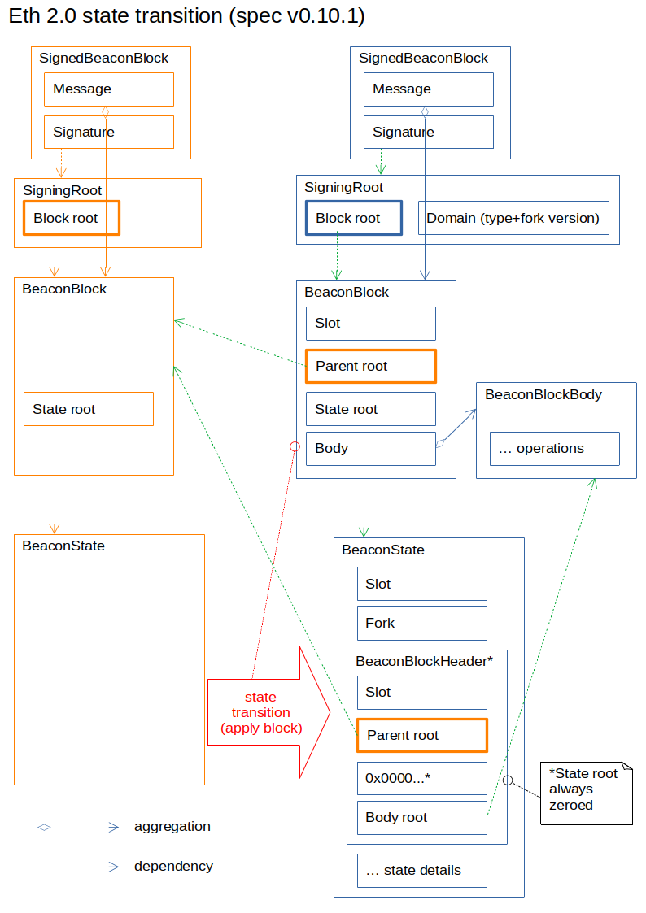
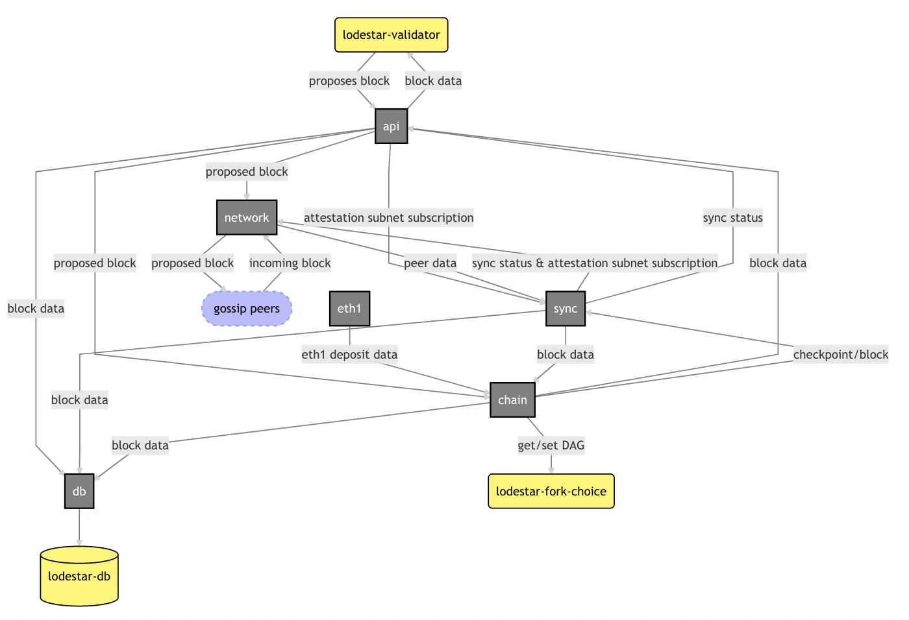

# Beacon Chain & Light Clients

## Overview

### Proof-of-Stake & the Beacon Chain

While the existing Ethereum PoW consensus relies on trusting the canonical chain with the most hashpower (difficulty), the Beacon Chain transitions to a PoS consensus model that relies on _virtual_ mining in the form of validators + cryptographic signatures instead of hashpower. Thus, the chain with the most stake is equivalent to a PoW chain with the most hashpower. Consensus is comprised of a validator model that signs blocks to be included in the chain — slots last 12 seconds long where a block has a _chance_ to be included (missed block proposals could be due to the block-proposing validator being offline or out of sync), epochs are 32 total slots (~6.4 minutes), and "eeks" ("ethereum week," used for various longer-term operations) are 2048 epochs (~9.1 days). An important note is that missing a block proposal increases the total number of attestations that are eligible for inclusion in the next block, which is a network inefficiency since it can further delay attestation inclusion for subsequent blocks, becoming "less attractive" as exclusion continues (i.e., due to [inclusion distance](https://www.attestant.io/posts/defining-attestation-effectiveness/)). A _block_ _proposer_ is a validator that has been psuedorandomly (on-chain, so not truly random) selected to build a block for a specific slot via a [RANDAO](https://github.com/randao/randao) function where weighing is based on the validator's balance. RANDAO generates the validator set 4 epochs in advance via a "random" seed, where there is a hash from the block proposer that is continually mixed (XOR'd) into the seed (hence, the pseudorandomness). Generally, a given validator will be part of the larger pool, acting as _attesters_ that vote on blocks for the Beacon Chain (and weighted by the validator's balance). Note that a validator must be running a Beacon Chain node and is executed through one or more validator clients — to use the validator client, there must be 32 ETH staked for each client (i.e., users stake ETH to "activate" validators). To summarize, beacon nodes maintain the state of the beacon chain, manage validators, apply rewards & penalties, maintain randomness, and determine the canonical chain with finality; validators propose beacon chain blocks and vote for blocks by making attestations.

### Consensus & Finality (with a Hint of Sharding)

Currently, there are [~250k validators](https://beaconcha.in/charts/validators) for the Beacon Chain (Oct. 2021), and consensus is driven by a subset of validators that attest (sign) blocks. In practice, this uses "committees" of a minimum of 128 validators (e.g., 1 proposing, and 127 attesting each block) and maximum 2048 (due to 32 slots \* 64 max committees per slot). That is, there can be more than 1 committee per block, and a validator will only be assigned to 1 committee within 1 slot. Attestations are grouped by committee (index) where each committee can have more than 1 attestation, assuming that each validator only votes once, and there is a minimum, maximum of 64, 128 (respectively) attestations required. Attestation aggregation by specific validators allows these votes to be summarized. Once the epoch has concluded, the validators are mixed & merged into new committees. When attesting to a Beacon Chain header, validators will follow the [Gasper consensus protocol](https://blog.ethereum.org/2020/02/12/validated-staking-on-eth2-2-two-ghosts-in-a-trench-coat/) — this combines Casper, for finality (aka deciding which blocks are/aren't part of the chain), and LMD GHOST (Last Message Driven Greediest Heaviest Observed SubTree), for fork choice voting (aka adding new blocks & deciding head). Note that from a security perspective, the PoW 51% attack exists in PoS; however, it not only would be very unlikely for a malicious party to control 51% of staked ETH but also economically detrimental to act maliciously with that much invested. Relatedly, consensus assumes _at least_ 2/3 of the validator committee's **_total balance_** is honest — it's [1 in a trillion probability](https://medium.com/@chihchengliang/minimum-committee-size-explained-67047111fa20) for malicious, byzantine validators being equal to or greater than 1/3 of the committee (aka PBFT).

While sharding is a WIP and subject to (minor) change, its implementation relates to the Beacon Chain. There are 64 total shards planned to be implemented (which requires at least ~262k validators), and there will be 1 Beacon Chain block with up to 64 shard blocks proposed for each slot. Note that the "old" PoW chain will exist as its own shard. In order to keep track of the shards and enable cross-shard interoperability, the Beacon Chain will contain "crosslinks" to the head of the shard chains, which are managed by committees during block-by-block changes. For example, a group of 512 validators would be subdivided into 4 committees of 128 validators for 1 slot — all 512 cast a Beacon Chain header vote for their slot using LMD GHOST (for head aka latest block's slot/hash), and then each committee is assigned a different shard to cross-link. If there is only 1 shard that proposes a block, then there will only be 1 crosslink included in the beacon block during that slot; if all 64 have a block prop, then there will be 64 crosslinks. Thus far, this process can be compared to voting for a local government election since each slot _but not the entire epoch_ is voted on by each committee of validators.

Epoch voting — a simile to voting for a national election — allows all of the validators to cast a vote on the entire epoch at specific "checkpoints" (or "epoch boundary blocks"), which are blocks in the first slot of an epoch or, if there is not a block in the first slot, the _most recent preceding_ block (e.g., possible for 1 block to be a checkpoint for more than 1 epoch). During the LMD GHOST vote, the validator includes a _target_ vote for the checkpoint in its current epoch — this is the Casper FFG vote, which also includes the previous checkpoint, called _source_. Recall, finality occurs once a _supermajority_ of at least 2/3 **_of the total effective balance of all active validators_** is reached. Once an epoch ends, the supermajority checkpoint in the current epoch gets _justified_ but is not _finalized_ until the checkpoint in the following epoch becomes justified. That is, a checkpoint will take 2 epochs to be finalized (~12.8 minutes). Note that a transaction will, on average, be in a block that is halfway through an epoch; thus, it will not reach finality until the current epoch ends plus the 2 checkpoints requirement (i.e., 2.5 epochs total, ~16 minutes). Attestations are aggregated for each block, and finality will only occur at epoch boundaries, which causes all of the preceding blocks within that epoch to also be finalized. In terms of sharding, this means that a shard chain's block will only be finalized once it's cross-linked and included in a beacon block that's reached finality.

For the aggregation process, a group of 16 aggregators are randomly selected from each committee, who aggregate attestations _matching its own attestation_ and then forward to the block proposer. This will always occur at 2/3 of the way through an epoch (aka at 8 seconds). So, putting all of these steps together, a validator client will generate the attestation, propagate it to aggregator(s) whom perform the proper aggregation, then propagating the aggregate to the block producer, where it is finally (hopefully) included.

> **Attest (Generate > Propagate > Aggregate > Propagate > Include). Justify. Finalize.**

Once finality is reached, a number of incentives are provided. Making attestations (LMD & FFG vote) that the majority of validators agree with will result in a reward, and with sharding, it will also reward for successful cross-links. However, if a validator does not attest to a block or attests to an unfinalized block, they will be penalized. Slashing is a harsher penalization type that ranges from 3-100% (aka at least 1/32) of an entire validator's 32 ETH stake; it occurs in 3 specific scenarios: double proposal (of multiple blocks in a slot), surround vote (where a first FFG checkpoint vote is surrounded by or surrounds a second FFG vote), or double vote (2 FFG votes in same epoch, e.g., voting for checkpoint in 2 chains of a fork). Lastly, there are whistleblower incentives using proofs to show a validator should be slashed, which results in a reward of 1/512 of the penalized validator's balance. A holistic way to view these incentives is in terms of staking ROI — if you're an honest validator, you can make ~10% a year through rewards but potentially lose 7.5% through penalties...being honest and staying online 55-70% of the time will result in profitability.

In summary:

- For every epoch, validators are evenly divided across 32 slots and then subdivided into committees
- Validators in a specific slot attempt to vote on the same Beacon Chain head (LMD GHOST vote)
- Validators in a specific slot attempt attempt to finalize the same checkpoints, target & source, to eventually help finalize their epoch (Casper FFG)
- Validators in a specific slot attempt to crosslink an assigned shard for their respective committee (future-state implementation)
- Validator signatures endorse the above (hashes) where 2/3 attestations on the current epoch's checkpoint results in _justification_ and is _finalized_ upon the subsequent checkpoint being justified — i.e., 2 epochs in a row with the same checkpoint pair results in finality of the source, thus, the source epoch's blocks' finality as well
- Once finality is reached (i.e., the 2 epochs for justification/finalization), rewards / penalties are distributed

## Light Clients & Sync Protocol

### Overview

Light clients will provide access to the Ethereum network for devices with insufficient hardware/capacity (phones, laptops, etc.) to run a full node or unable to be constantly connected, thus, creating an inability to connect to the network directly. To enable network connectivity, [Sync Protocol](https://github.com/ethereum/annotated-spec/blob/master/altair/sync-protocol.md) (introduced in Altair) allows light clients to only keep track of the block headers — this greatly reduces the load on the device and lowers the barrier to entry. Any data not present in the block header would result in some sort of deeper query request (e.g., Merkle proof for tx or state history) to non-light-clients that have the associated data. Note that currently, Ethereum clients are heavy due to the design Ethereum's networking protocol; DevP2P includes the ETH protocol as well as gossip (blocks, txs), history (headers, blocks, receipts), and syncing state (being replaced by Snap protocol). These are aspects related to Portal Network as it tries to redesign the networking aspect.

[Altair introduces a minimal light client](https://github.com/ethereum/consensus-specs/blob/dev/specs/altair/sync-protocol.md) friendly design that includes smaller "sync committees" signing canonical blocks; it's an extension of the beacon chain. However, with a smaller subset signing blocks, this poses a security risk as they are easier to corrupt. To account for this, the overall validator committee set is very large (512 validators), with random shuffling, and somewhat frequent rotation (short lookahead of 256 epochs; ~27 hours) — this makes it difficult to coordinate an attack among the sync committee subset. The timing of committee rotations accelerates syncing for light clients since the current validator sync committee will be validating every block in a given time period and also signing off on the next committee. This allows a light client to "skip" to a single block within each 256 epoch period since one block will have the signatures of the current and next committee. Once the light client is fully up-to-date, it can start syncing with each block instead of this skip-like sync. An interesting point is that current cross-chain trustless bridges are essentially using a light client model wherein a light client of the Beacon Chain and _X_ chain are required to interoperate.

The rationale behind sync committees is the following: light clients must be able to keep track of beacon block headers, but existing functionality (signing block headers, block proposals, and block attestation) doesn't allow for this since computing the proposer or attesters at a given slot requires a calculation on the _entire active validator set_. A light client, by definition, does not and cannot have access to the entire validator set, otherwise, they'd be much too heavy. Since sync committees are updated infrequently and are saved to beacon state, a light client can easily look up & verify the committee (Merkle branch), allowing the light client to then access the list of validator public keys within the sync committee. This list of public keys can be used (while the current sync committee is still assigned/active) to speed up the syncing of more recent blocks through directly authenticating their signatures.

In total, the minimum cost for light clients to track the chain is only about 25 kB per two days: 24576 bytes for the 512 48-byte public keys in the sync committee, plus a few hundred bytes for the aggregate signature, the light client header, and the Merkle branch. However, it's important to note this process does not enable a light client to "closely" follow the chain in a resource-constrained way. That is, the light client would have to download each header it's verifying (plus the signature for it) in order to stat up-to-date; instead, it allows the light client to grab & verify miscellaneous data within its resource-constrained setting.

### Portal Network & Statelessness

Portal Network, for example, aims to build a light client for low powered devices while being scalable, not requiring syncing, and maintaining usage of JSON RPC. A related concept that acts as a catalyst for light clients is statelessness. Statelessness is a change in the consensus & networking protocol that removes state from a client's requirements — if a client needs access to a specific piece of state to execute a block, it would leverage a "witness" (Merkle/Verkle proof) to retrieve that piece of data. That is, statelessness helps solve the accessibility problem for low powered devices and doesn't require fully syncing (e.g., no need to store state or chain history). However, there are still challenges when it comes to scalability and JSON RPC connections (contract interaction, tx sending, etc.) — since DevP2P expects state/chain history, a stateless client in the current Ethereum model would not abide by DevP2P requirements. This is the reason the Portal Network aims to redesign Ethereum with a new P2P network, specifically made for light clients.

# Specification Walkthrough

A note on Altair — Phase 0 was implemented in Dec. 2020, which created basic functionality for PoS & the Beacon Chain (e.g., validating empty blocks, pre-merge), also allowing for separation into execution and consensus clients (as well as changes from RLP to [SSZ encoding](https://github.com/ethereum/consensus-specs/blob/dev/ssz/simple-serialize.md) for efficiency purposes). Altair (Oct. 2021) is the first Beacon Chain hardfork and extends its functionality with the following:

- sync committees to support light clients
- incentive accounting reforms to reduce spec complexity
- brings inactivity and slashing penalties up to their full values

### Beacon Chain in Altair

There are a number of steps involved during the Beacon Chain's state transition — assuming the validator has been added/processed into [`BeaconState`](https://github.com/ethereum/consensus-specs/blob/dev/specs/phase0/beacon-chain.md#beaconstate) via [`process_deposits`](https://github.com/ethereum/consensus-specs/blob/dev/specs/phase0/beacon-chain.md#deposits), which requires a [`Deposit`](https://github.com/ethereum/consensus-specs/blob/dev/specs/phase0/beacon-chain.md#deposit) (Merkle proof of deposit contract in Eth PoW chain) container with [`DepositData`](https://github.com/ethereum/consensus-specs/blob/dev/specs/phase0/beacon-chain.md#deposit) that identifies the validator & the ETH deposit amount. Note that successfully becoming a validator results in a global `ValidatorIndex` being permanently assigned, which is different than the pubkey/address.

1. [`Validator`](https://github.com/ethereum/consensus-specs/blob/dev/specs/phase0/beacon-chain.md#validator) is assigned to a Beacon Chain committee, sync committee (exist in state as current/next [`SyncCommittee`](https://github.com/ethereum/annotated-spec/blob/master/altair/beacon-chain.md#synccommittee)), & a block proposer is selected using RANDAO
   1. Each epoch has a number of operations that occur in [`process_epoch`](https://github.com/ethereum/consensus-specs/blob/dev/specs/altair/beacon-chain.md#justification-and-finalization), including [`process_randao_mixes_reset`](https://github.com/ethereum/consensus-specs/blob/dev/specs/phase0/beacon-chain.md#randao-mixes-updates), which updates `randao_mixes` for a specific lookahead(?) (e.g., recall that RANDAO has a min/max seed lookahead for security purposes)
   2. Each new beacon block verifies the current RANDAO & updates beacon state's `randao_mixes` within [`process_block`](https://github.com/ethereum/consensus-specs/blob/dev/specs/altair/beacon-chain.md#block-processing) where mixing/verifying in the RANDAO reveal is via [`process_randao`](https://github.com/ethereum/consensus-specs/blob/dev/specs/phase0/beacon-chain.md#randao)
   3. [`get_beacon_committee`](https://github.com/ethereum/consensus-specs/blob/dev/specs/phase0/beacon-chain.md#get_beacon_committee) returns [`compute_committee`](https://github.com/ethereum/consensus-specs/blob/dev/specs/phase0/beacon-chain.md#compute_committee) (a list of committee indices) → occurs at beginning of epoch
   4. [`get_beacon_proposer_index`](https://github.com/ethereum/consensus-specs/blob/dev/specs/phase0/beacon-chain.md#get_beacon_proposer_index) returns [`compute_proposer_index`](https://github.com/ethereum/consensus-specs/blob/dev/specs/phase0/beacon-chain.md#compute_proposer_index) (the block proposer) → occurs at beginning of epoch
   5. [`get_sync_committee_indices`](https://github.com/ethereum/annotated-spec/blob/master/altair/beacon-chain.md#get_sync_committee_indices) returns a list (allowing dupes for small validator sets) → occurs every at sync committee period boundaries, which happen every 256 epoch and define the _next_ period's committee (in [`process_sync_committee_updates`](https://github.com/ethereum/annotated-spec/blob/master/altair/beacon-chain.md#sync-committee-updates))
   6. note: committee/proposer selection requires a seed via [`get_seed`](https://github.com/ethereum/consensus-specs/blob/dev/specs/phase0/beacon-chain.md#get_seed) & [`get_randao_mix`](https://github.com/ethereum/consensus-specs/blob/dev/specs/phase0/beacon-chain.md#get_randao_mix) that's also used by [`compute_shuffled_index`](https://github.com/ethereum/consensus-specs/blob/dev/specs/phase0/beacon-chain.md#compute_shuffled_index) (for randomizing/selecting)
2. A [`Validator`](https://github.com/ethereum/consensus-specs/blob/dev/specs/phase0/beacon-chain.md#validator) creates an attestation via [`AttestationData`](https://github.com/ethereum/consensus-specs/blob/dev/specs/phase0/beacon-chain.md#attestationdata), which includes references to its epoch's `slot`, validator `index` within the committee, its LMD GHOST vote for `beacon_block_root`, and FFG source/target [`Checkpoint`](https://github.com/ethereum/consensus-specs/blob/dev/specs/phase0/beacon-chain.md#block-processing) data

   ```python
   class AttestationData(Container):
       slot: Slot
       index: CommitteeIndex
       # LMD GHOST vote
       beacon_block_root: Root
       # FFG vote
       source: Checkpoint
       target: Checkpoint
   ```

3. An aggregating validator (from beacon chain committees) uses [`Attestation`](https://github.com/ethereum/consensus-specs/blob/dev/specs/phase0/beacon-chain.md#attestation) to aggregate identical attestations and re-broadcast them to the network; includes a bitfield map (of length committee size) of those attesting and the aggregation of their signatures

   ```python
   class Attestation(Container):
       aggregation_bits: Bitlist[MAX_VALIDATORS_PER_COMMITTEE]
       data: AttestationData
       signature: BLSSignature
   ```

   1. Related — [`IndexedAttestation`](https://github.com/ethereum/consensus-specs/blob/dev/specs/phase0/beacon-chain.md#indexedattestation) is used only in [`AttesterSlashing`](https://github.com/ethereum/consensus-specs/blob/dev/specs/phase0/beacon-chain.md#attesterslashing) and includes a list of the the validators' index instead of the committee's bitfield map (in case of cross-chain interoperability where a chain wouldn't have committee info)
   2. Related — [`PendingAttestation`](https://github.com/ethereum/consensus-specs/blob/dev/specs/phase0/beacon-chain.md#pendingattestation) was part of Phase 0 and would be created during block processing but not processed until the end of an epoch, thus, _all_ pending attestations were processed at the same time. In Altair, this was removed due to inefficiencies and instead replaced with [`ParticipationFlags`](https://github.com/ethereum/annotated-spec/blob/master/altair/beacon-chain.md#custom-types)
      1. [`ParticipationFlags`](https://github.com/ethereum/annotated-spec/blob/master/altair/beacon-chain.md#custom-types) is a byte array that tracks a validator's attestation duties for each epoch as boolean flags — the first 3 bits are LMD GHOST head vote, FFG target, and FFG source (respectively); the remaining bits are currently unreserved. This is updated immediately (once the duty is fulfilled) instead of waiting to be processed at the end of an epoch
      2. Note that non-attestation duties are not described in this array but include submitting a sync committee signature and block proposal duties
   3. Namely, the aggregating validator will use [`AggregateAndProof`](https://github.com/ethereum/consensus-specs/blob/dev/specs/phase0/validator.md#aggregateandproof) and [`SignedAggregateAndProof`](https://github.com/ethereum/consensus-specs/blob/dev/specs/phase0/validator.md#signedaggregateandproof) in order to [broadcast this to the network on the proper subnet](https://github.com/ethereum/consensus-specs/blob/dev/specs/phase0/validator.md#broadcast-attestation)
      ```python
      class AggregateAndProof(Container):
          aggregator_index: ValidatorIndex
          aggregate: Attestation
          selection_proof: BLSSignature
      ```

4. A selected block producer creates a [`BeaconBlock`](https://github.com/ethereum/consensus-specs/blob/dev/specs/phase0/beacon-chain.md#beaconblock) that uses the attestations aggregate within its containerized [`BeaconBlockBody`](https://github.com/ethereum/consensus-specs/blob/dev/specs/phase0/beacon-chain.md#beaconblockbody) and then signs it — resulting in [`SignedBeaconBlock`](https://github.com/ethereum/consensus-specs/blob/dev/specs/phase0/beacon-chain.md#signedbeaconblock), consisting of a message (aka the [`BeaconBlock`](https://github.com/ethereum/consensus-specs/blob/dev/specs/phase0/beacon-chain.md#beaconblock) and signature)

   ```python
   class BeaconBlock(Container):
       slot: Slot
       proposer_index: ValidatorIndex
       parent_root: Root
       state_root: Root
       body: BeaconBlockBody

   class BeaconBlockBody(Container):
       randao_reveal: BLSSignature
       eth1_data: Eth1Data  # Eth1 data vote
       graffiti: Bytes32  # Arbitrary data
       # Operations
       proposer_slashings: List[ProposerSlashing, MAX_PROPOSER_SLASHINGS]
       attester_slashings: List[AttesterSlashing, MAX_ATTESTER_SLASHINGS]
       attestations: List[Attestation, MAX_ATTESTATIONS]
       deposits: List[Deposit, MAX_DEPOSITS]
       voluntary_exits: List[SignedVoluntaryExit, MAX_VOLUNTARY_EXITS]
       sync_aggregate: SyncAggregate  # [New in Altair]
   ```

   1. A number of fields are included in the body — notably, `randao_reveal` (seed for randomness when mixed with other proposer's reveal)
   2. Various incentives-based operations are provided if successfully included & processed
   3. [`SyncAggregate`](https://github.com/ethereum/annotated-spec/blob/master/altair/beacon-chain.md#syncaggregate) is similar to an [`Attestation`](https://github.com/ethereum/consensus-specs/blob/dev/specs/phase0/beacon-chain.md#attestation) in the sense that it contains a bitfield map of sync attestations as well as an aggregate of the sync committee's validator signatures

      ```python
      class SyncAggregate(Container):
          sync_committee_bits: Bitvector[SYNC_COMMITTEE_SIZE]
          sync_committee_signature: BLSSignature
      ```

   4. Note that [`Eth1Data`](https://github.com/ethereum/consensus-specs/blob/dev/specs/phase0/beacon-chain.md#eth1data) is used to track the validators depositing into the deposit contract its associated Eth1 block hash

5. The [`state_transition`](https://github.com/ethereum/consensus-specs/blob/dev/specs/phase0/beacon-chain.md#beacon-chain-state-transition-function) function is called with each block and takes the signed beacon block, verifies it, and then processes the slots, blocks, and (potentially, depending on current slot) epoch

   ```python
   def state_transition(state: BeaconState, signed_block: SignedBeaconBlock, validate_result: bool=True) -> None:
       block = signed_block.message
       # Process slots (including those with no blocks) since block
       process_slots(state, block.slot)
       # Verify signature
       if validate_result:
           assert verify_block_signature(state, signed_block)
       # Process block
       process_block(state, block)
       # Verify state root
       if validate_result:
           assert block.state_root == hash_tree_root(state)
   ```

   1. [`process_slots`](https://github.com/ethereum/consensus-specs/blob/dev/specs/phase0/beacon-chain.md#beacon-chain-state-transition-function) will process each slot individually with [`process_slot`](https://github.com/ethereum/consensus-specs/blob/dev/specs/phase0/beacon-chain.md#beacon-chain-state-transition-function) (used to cache state & block roots) and then call [`process_epoch`](https://github.com/ethereum/consensus-specs/blob/dev/specs/phase0/beacon-chain.md#epoch-processing) if the slot is the start/checkpoint of the epoch

      1. Note that [`process_slot`](https://github.com/ethereum/consensus-specs/blob/dev/specs/phase0/beacon-chain.md#beacon-chain-state-transition-function) also caches state with _latest_ [`BeaconBlockHeader`](https://github.com/ethereum/consensus-specs/blob/dev/specs/phase0/beacon-chain.md#beaconblockheader) state root, which is basically a beacon block but with the full body replaced by the body root

         - That is, in `process_slot`, the state has not been changed, thus, its referencing the _latest_ block & state

         ```python
         class BeaconBlockHeader(Container):
             slot: Slot
             proposer_index: ValidatorIndex
             parent_root: Root
             state_root: Root
             body_root: Root

         def process_slot(state: BeaconState) -> None:
             # Cache state root
             previous_state_root = hash_tree_root(state)
             state.state_roots[state.slot % SLOTS_PER_HISTORICAL_ROOT] = previous_state_root
             # Cache latest block header state root
             if state.latest_block_header.state_root == Bytes32():
                 state.latest_block_header.state_root = previous_state_root
             # Cache block root
             previous_block_root = hash_tree_root(state.latest_block_header)
             state.block_roots[state.slot % SLOTS_PER_HISTORICAL_ROOT] = previous_block_root
         ```

   2. [`process_block`](https://github.com/ethereum/consensus-specs/blob/dev/specs/altair/beacon-chain.md#block-processing) includes the aforementioned RANDAO mixing, creates the `BeaconBlockHeader`, and sync committees are processed (which is new in Altair; used for light clients)

      ```python
      def process_block(state: BeaconState, block: BeaconBlock) -> None:
          process_block_header(state, block)
          process_randao(state, block.body)
          process_eth1_data(state, block.body)
          process_operations(state, block.body)  # [Modified in Altair]
          process_sync_aggregate(state, block.body.sync_aggregate)  # [New in Altair]
      ```

      1. [`process_sync_aggregate`](https://github.com/ethereum/consensus-specs/blob/dev/specs/altair/beacon-chain.md#sync-aggregate-processing) updates beacon state with the sync committee aggregate — this is important as it enables light clients to retrieve block headers, verified by sync committee signatures
      2. [`process_block_header`](https://github.com/ethereum/consensus-specs/blob/dev/specs/phase0/beacon-chain.md#block-header) takes the global state and beacon block to then update the state's latest block header after the following steps:
         1. Verify that the block & state slots match as well as the block proposer's index not only being correct but also not a slashed validator
         2. Ensure the proposed block's slot is newer than the latest block header and that the most proposed block's parent is the most recent block
            1. e.g., state could have been updated with a block already for the current slot, thus, don't want to accept a new block for the current slot
         3. If the above conditions are met, the block is cached in state as the latest block header

   3. The epoch is processed ([`process_epoch`](https://github.com/ethereum/consensus-specs/blob/dev/specs/altair/beacon-chain.md#justification-and-finalization)) such that justification/finalization are determined ([`process_justification_and_finalization`](https://github.com/ethereum/consensus-specs/blob/dev/specs/altair/beacon-chain.md#justification-and-finalization)), incentives are distributed, and syncs are updated for the next period (once every 256 epochs)

      ```python
      def process_epoch(state: BeaconState) -> None:
          process_justification_and_finalization(state)  # [Modified in Altair]
          process_inactivity_updates(state)  # [New in Altair]
          process_rewards_and_penalties(state)  # [Modified in Altair]
          process_registry_updates(state)
          process_slashings(state)  # [Modified in Altair]
          process_eth1_data_reset(state)
          process_effective_balance_updates(state)
          process_slashings_reset(state)
          process_randao_mixes_reset(state)
          process_historical_roots_update(state)
          process_participation_flag_updates(state)  # [New in Altair]
          process_sync_committee_updates(state)  # [New in Altair]
      ```

### Sync Protocol for Light Clients

In relation to [minimal light clients & the Sync Protocol](https://github.com/ethereum/annotated-spec/blob/master/altair/sync-protocol.md#minimal-light-client), a light client that wants to learn about new block headers from the beacon chain would have to do the following:

1. Use a Merkle branch to verify the `next_sync_committee` from an existing block that has been downloaded (aka the next period's sync committee that is set to sign block headers)

   1. [`LightClientSnapshot`](https://github.com/ethereum/annotated-spec/blob/master/altair/sync-protocol.md#lightclientsnapshot) stores its view of the most recent beacon block header and both the current & next [`SyncCommittee`](https://github.com/ethereum/annotated-spec/blob/master/altair/beacon-chain.md#synccommittee)

      ```python
      class LightClientSnapshot(Container):
          # Beacon block header
          header: BeaconBlockHeader
          # Sync committees corresponding to the header
          current_sync_committee: SyncCommittee
          next_sync_committee: SyncCommittee

      class SyncCommittee(Container):
          pubkeys: Vector[BLSPubkey, SYNC_COMMITTEE_SIZE]
          aggregate_pubkey: BLSPubkey
      ```

2. Download the aggregate signature of the newer header that the light client is trying to authenticate (found in the child block of the newer block; can be supplied via p2p network or in a client-server request)

   1. [`LightClientUpdate`](https://github.com/ethereum/annotated-spec/blob/master/altair/sync-protocol.md#lightclientupdate) is served to light clients, which provides all of the data needed for a client to get new block headers and also verify them (e.g., sync committee related data, requested block header, and post-state finality proof of the header block that finalizes the update's latest beacon block)

      - note that if there is no finality header proof for the block, then the header itself is what should be verified; however, if one is provided, its corresponding `finality_branch` is grabbed from state's `finalized_checkpoint` as a [generalized index](https://github.com/ethereum/consensus-specs/blob/dev/ssz/merkle-proofs.md#generalized-merkle-tree-index), which defines a node's position (index) in its Merkle trie's linear representation (e.g., to get from a leaf to the root of a tree)

   2. Signatures are then aggregated with [`SyncAggregate`](https://github.com/ethereum/annotated-spec/blob/master/altair/beacon-chain.md#syncaggregate)

      ```python
      class LightClientUpdate(Container):
          # Update beacon block header
          header: BeaconBlockHeader
          # Next sync committee corresponding to the header
          next_sync_committee: SyncCommittee
          next_sync_committee_branch: Vector[Bytes32, floorlog2(NEXT_SYNC_COMMITTEE_INDEX)]
          # Finality proof for the update header
          finality_header: BeaconBlockHeader
          finality_branch: Vector[Bytes32, floorlog2(FINALIZED_ROOT_INDEX)]
          # Sync committee aggregate signature
          sync_committee_bits: Bitvector[SYNC_COMMITTEE_SIZE]
          sync_committee_signature: BLSSignature
          # Fork version for the aggregate signature
          fork_version: Version

       class SyncAggregate(Container):
        sync_committee_bits: Bitvector[SYNC_COMMITTEE_SIZE]
        sync_committee_signature: BLSSignature
      ```

3. Add together the public keys of the subset of the sync committee that participated in the aggregate signature (sync committee aggregate contains a bitfield map of those signing)
4. Verify the signature against the combined public key and the newer block header; if verification passes, the new block header has been successfully authenticated

   1. [`LightClientStore`](https://github.com/ethereum/annotated-spec/blob/master/altair/sync-protocol.md#lightclientstore) saves the full "state" of the light client, consisting of:

      1. The most recent _finalized-ish_ [`LightClientSnapshot`](https://github.com/ethereum/annotated-spec/blob/master/altair/sync-protocol.md#lightclientsnapshot) (i.e., these are block headers that the light client accepts as finalized, but it's a weaker notion of finality as compared to a normal client's finality definition)
      2. List of all _valid-ish_ [`LightClientUpdate`](https://github.com/ethereum/annotated-spec/blob/master/altair/sync-protocol.md#lightclientupdate) objects (i.e., they are speculatively "valid" due to strong support but have potential for reversion)

      ```python
      @dataclass
      class LightClientStore(object):
          snapshot: LightClientSnapshot
          valid_updates: Set[LightClientUpdate]
      ```

   2. Every update triggers the light client to process an update ([`process_light_client_update`](https://github.com/ethereum/annotated-spec/blob/master/altair/sync-protocol.md#process_light_client_update)) and check these cases in order to update the snapshot:
      1. Check the update's validity ([`validate_light_client_update`](https://github.com/ethereum/annotated-spec/blob/master/altair/sync-protocol.md#validate_light_client_update))
         1. No skipped period syncs since the most recent snapshot and that block header is newer than its most recent update
         2. Verify the beacon block's finality via either (1) signature of the provided finality block header or (2) if no finality header/branch provided, assume the primary block header is finalized and then grab the `finalized_checkpoint` from state to provide the `finality_branch` for authentication
         3. Sync committee has at least 1 participant and has a valid aggregate signature — and if the sync period has been incremented, also check next sync committee (via generalized Merkle index for beacon state's `next_sync_committee`)
      2. If the above hold true, this allows the update to be added to `valid_updates` (technically, _speculative_ valid/finalized updates) — for it to be truly accepted by the light client as a `snapshot`, there must be least 2/3 participating sync committee signatures
      3. Note that if there are no valid updates with 2/3 signatures for an entire sync period (i.e., non-finality), the light client can still advance by accepting the speculative header in `valid_updates` with the most signatures as the new `snapshot`
         1. Long periods of non-finality leaves clients vulnerable to network latency of 1 period (aka 27 hours)

For context, the Beacon Chain's global state ([`BeaconState`](https://github.com/ethereum/consensus-specs/blob/dev/specs/altair/beacon-chain.md#beaconstate)) in Altair is the following:

```python
class BeaconState(Container):
    # Versioning
    genesis_time: uint64
    genesis_validators_root: Root
    slot: Slot
    fork: Fork
    # History
    latest_block_header: BeaconBlockHeader
    block_roots: Vector[Root, SLOTS_PER_HISTORICAL_ROOT]
    state_roots: Vector[Root, SLOTS_PER_HISTORICAL_ROOT]
    historical_roots: List[Root, HISTORICAL_ROOTS_LIMIT]
    # Eth1
    eth1_data: Eth1Data
    eth1_data_votes: List[Eth1Data, EPOCHS_PER_ETH1_VOTING_PERIOD * SLOTS_PER_EPOCH]
    eth1_deposit_index: uint64
    # Registry
    validators: List[Validator, VALIDATOR_REGISTRY_LIMIT]
    balances: List[Gwei, VALIDATOR_REGISTRY_LIMIT]
    # Randomness
    randao_mixes: Vector[Bytes32, EPOCHS_PER_HISTORICAL_VECTOR]
    # Slashings
    slashings: Vector[Gwei, EPOCHS_PER_SLASHINGS_VECTOR]  # Per-epoch sums of slashed effective balances
    # Participation
    previous_epoch_participation: List[ParticipationFlags, VALIDATOR_REGISTRY_LIMIT]  # [Modified in Altair]
    current_epoch_participation: List[ParticipationFlags, VALIDATOR_REGISTRY_LIMIT]  # [Modified in Altair]
    # Finality
    justification_bits: Bitvector[JUSTIFICATION_BITS_LENGTH]  # Bit set for every recent justified epoch
    previous_justified_checkpoint: Checkpoint
    current_justified_checkpoint: Checkpoint
    finalized_checkpoint: Checkpoint
    # Inactivity
    inactivity_scores: List[uint64, VALIDATOR_REGISTRY_LIMIT]  # [New in Altair]
    # Sync
    current_sync_committee: SyncCommittee  # [New in Altair]
    next_sync_committee: SyncCommittee  # [New in Altair]
```

The following provides a visualizations of what's happening with state in the Beacon Chain, post-attestation:

|                                         |
| :-----------------------------------------------------------------------------------------------------: |
| Source: [Eth 2.0 State Transition](https://sgryphon.wordpress.com/2020/03/17/eth-2-0-state-transition/) |

And in relation to light clients, this also provides a clear workflow on the data flow (at least how Lodestar has designed their light client):

|                                      |
| :--------------------------------------------------------------------------------------------------: |
| Source: [ChainSafe Lodestar Architecture](https://chainsafe.github.io/lodestar/design/architecture/) |

---

### Sources

- [The Beacon Chain Ethereum 2.0 explainer you need to read first](https://ethos.dev/beacon-chain/)
- [Vitalik's Annoted Ethereum 2.0 Spec](https://notes.ethereum.org/@vbuterin/SkeyEI3xv)
- [Light Client Design in Eth2](https://www.youtube.com/watch?v=ysW-Bq05pJQ)
- [Stateless Ethereum and The Portal Network](https://www.youtube.com/watch?v=jAX_bgcESoc)
- [Ethereum 2.0 Knowledge Base](https://kb.beaconcha.in/glossary#beacon-chain)
- [Ethereum 2.0 Phase 0 -- The Beacon Chain](https://benjaminion.xyz/eth2-annotated-spec/phase0/beacon-chain/)
- [Combining GHOST and Casper](https://arxiv.org/pdf/2003.03052.pdf)
- [Defining Attestation Effectiveness](https://www.attestant.io/posts/defining-attestation-effectiveness/)
- [Attestation Inclusion](https://www.youtube.com/watch?v=SPcgevcDqDE)
- [Eth 2.0 State Transition](https://sgryphon.wordpress.com/2020/03/17/eth-2-0-state-transition/)
- [Minimal Light Client](https://github.com/ethereum/annotated-spec/blob/master/altair/sync-protocol.md)
