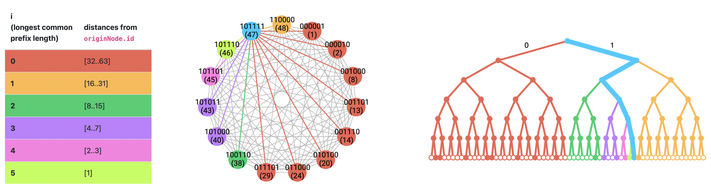

# p2p Consensus Networking

This document is intended to provide an overview of Ethereum's networking basics within its consensus layer. A number of steps and processes must happen in order to propagate data across the entire network; this includes a variety of p2p mechanisms for discovering peers, storing information about its peers (identification, services), and distributing Ethereum state data.

## Discovery

### Background on Kademlia DHT

The following reviews the [academically-defined version of Kademlia](https://pdos.csail.mit.edu/~petar/papers/maymounkov-kademlia-lncs.pdf), which differs slightly from Ethereum's implementation, described in the following section. [Kademlia](https://pdos.csail.mit.edu/~petar/papers/maymounkov-kademlia-lncs.pdf) is a Distributed Hash Table (DHT) for establishing peer-to-peer connections using an XOR distance metric. Nodes are key-value stores where nodes & keys are identified by 160-bit addresses within a binary tree whose leaves are $k$-buckets; a $k$-bucket stores a list of routing addresses of other nodes in the network as a tuple of _(IP address, UDP port, Node ID)_. Each value is stored at $k$ nodes whose node IDs are closest to the key ID; the distance between two nodes is determined through an XOR of their node IDs (e.g., $distance(1, 4) = d(0b001, 0b100) = 0b001 \text{ } XOR \text{ } 0b100 = 0b101 = 5$). In fully populated tree, the magnitude of the distance between IDs is the height of the smallest subtree containing both; in less-than-full trees, the distance is defined by the longest common prefix between IDs, starting from the root node to $i$ (e.g., 1100 and 1110 would share a tree depth/distance of 2). Each node keeps a list of $N$ $k$-buckets, where $N$ is the number of bits in a key/node ID (e.g., 160 bits). Formally, for $0 \le i \lt N $, the $i$-th $k$-bucket will contain up to $k$ (default value is $k=20$) values for node distances between $2^i$ and $2^{i+1}$ from itself; each node will know at least 1 node in its subtree. Note that here, $k$ represents a constant replication parameter such that any given $k$ nodes are unlikely to fail within an hour of each other. Frequency determines the location of the $k$-bucket in storage; the least recently seen will be at the head and most recent at the tail.

A visualization of how the distance & longest prefix (logarithmic distance) correspond to Kademlia node IDs, where colors represent k-buckets | Source: [Kademlia Basics](https://kelseyc18.github.io/kademlia_vis/basics/3/)

In order to discover nodes on the network, Kademlia supports the following RPCs where all require a recipient to echo an $N$-bit random RPC ID; up to $\alpha$ concurrent requests can occur at once, often defaulting to $\alpha=3$:

- `PING` ⇒ probes a node to see if it is online
- `STORE` ⇒ instructs a node to store a [key, value] pair for later retrieval
- `FIND_NODE` ⇒ takes the $N$-bit key as an argument where the recipient of the `FIND_NODE` RPC returns a _(IP address, UDP port, Node ID)_ tuple for each of the $k$ nodes closest to the target ID
  - Can come from one or multiple $k$-buckets; just must return $k$ items (unless it doesn't have $k$, in which case, it returns all nodes)
- `FIND_VALUE` ⇒ returns _(IP address, UDP port, Node ID)_ for the $k$ nodes closest to the target identifier with one exception – if the RPC recipient has received a `STORE` for the given key, it returns the stored value

After a node joins the network, it's assigned a node ID and has its $k$ table initialized with a peer node. It then will perform `FIND_NODE` on itself to fill out its $k$ table, find its $k$-closest nodes, and continues this on other nodes as it updates its table by either adding or updating new nodes. That is, with each proceeding request or reply, a node will update its $k$-bucket list and other nodes' position for most/least recently seen within the list. For new nodes discovered, when a $k$-bucket is full, the recipient will ping the least recently seen node and decide to either discard them (if there is no response) and replace it with the sender, or the sending node will update the table (if there is a response) and move the recipient node to the tail. This provides resistance against DDoS attacks because flooding nodes' routing state will not result in flushing out the $k$-tables with new nodes; as long as a node is active, it remains in the table.

### discv5

There are a number of protocols as part of Ethereum's devp2p networking stack, including [discv5](https://github.com/ethereum/devp2p/blob/master/discv5/discv5.md) (node discovery protocol) and [RLPx](https://github.com/ethereum/devp2p/blob/master/rlpx.md) (wire protocol); libp2p is a separate but similar project that devp2p is adopting over time. Ethereum nodes use discv5 as a _modified_ Kademlia DHT implementation, which is enables peer discovery while running UDP on a dedicated port, supports peer [Ethereum Node Records](https://eips.ethereum.org/EIPS/eip-778) (ENRs), and topic-based advertisements. Other modifications discv5 applies to the previously described Kademlia includes a 256-bit (serialized) node ID (instead of 160 bits), thus, also a deeper tree structure (since it's equivalent to the node ID bits), as well as a $k$-bucket limit of 16 (instead of the aforementioned 20). In order words, for $0 \le i < 256$, the $i$th $k$-bucket will contain up to $k=16$ values for node distances between $2^i$ and $2^{i+1}$ from itself (i.e., $logdistance(self, \text{ }N) == i$).

A client should integrate discv5 into its libp2p stack (for service discovery & peer routing) to form connections and streams with discovered peers. Namely, libp2p should take inputs of peer ID or requested service capabilities and then output the multiaddrs converted from the ENR records returned by the discv5 backend. Note that ENRs contain a signature, sequence (64-bit uint that is incremented upon record changes), and, technically optional but should be included, a series of key-value pairs: scheme ID (only one that's _required, e.g_., `v4`), compressed secp256k1 publickey (33 bytes) of its node ID, IPv4/6 addresses, TCP port (for libp2p listening), and UDP port (for discv5 listening). Thus, a node record is an RLP list such that `record = [signature, seq, k, v, ...]` where the maximum encoded size of a record is 300 bytes. Anyone participating must maintain a local record of nodes and increment their sequence upon updates in node records or their own (e.g., changes in IP or ports); this table maintenance process should happen at regular intervals (e.g., sending asynchrounous `PING` message and not just waiting for peer messages to trigger an update).

There are three primary actors in the system: advertisers ([advertise they're running an application for specific topic](https://github.com/ethereum/devp2p/blob/master/discv5/discv5-theory.md#topic-advertisement)), registrar (holding ENR registry/date), and searches (those requesting for nodes that support a specific topic application). A node that is providing a specific service will "place an ad" for itself, making it discoverable under that topic — zero or multiple topics can be advertised, but all nodes must act as an advertisement medium where it accepts an ad and returns nodes searching for that topic. [Ad placement](https://github.com/ethereum/devp2p/blob/master/discv5/discv5-theory.md#ad-placement-and-topic-radius) can, basically, be on any node in the network to maintain an even distribution; however, topic searches must specify a topic radius for nodes that are advertising the topic, determined using the Kademlia distance metric. Thus, ad placement will also refine its placement — starting from the entire network and refining to a subset of nodes, based on an [estimation factor using ticket queues' waiting time for specific address ranges](https://github.com/ethereum/devp2p/blob/master/discv5/discv5-theory.md#topic-radius-estimation). From an implementation perspective, these topics are stored in table of topic queues, holding all unique node IDs that provide the associated service; a node receives a ticket upon placing an ad as waits to be accepted into the queue.

The available protocol messages are as follows where every req/res includes message data and its message type (0x...), where message data includes request ID that is some arbitrary RLP byte array (≤ 8 bytes) created by the requester (and subsequently mirrored by the recipient):

- `PING` request (0x01) ⇒ checks if recipient is alive and includes the sender's ENR sequence number
  - e.g., sends `message-data = [request-id, enr-seq]`, `message-type = 0x01`
- `PONG` response (0x02) ⇒ reply to `PING` and includes an echo of the `PING`/sender data as well as information about itself (IP address, UDP port)
- `FINDNODE` request (0x03) ⇒ queries for nodes at a given distance from the recipient's node ID (recall, not physical distance but XOR'd node ID from Kademlia trie); recipient returns nodes within distance from its local table (≤ 16 total nodes can be provided)
  - note: often, instead of using the standalone XOR'd distance, it will be the _logarithmic distance_ $log_2(N1 \text{ }XOR\text{ } N2)$ of the XOR'd distance; that is, $log_2$ of the distance is equivalent to the length of the node IDs' longest common prefix in bits
- `NODES` response (0x04) ⇒ response(s) to `FINDNODE` or `TOPICQUERY` queries and includes a list of the ENR records that fulfill the query (e..g, `message-data = [request-id, total, [ENR, ...]]`) where multiple messages can be sent
  - i.e., the max size of any packet is 1280 bytes, and each ENR is max 300 bytes; thus, 16 max records \* 300 bytes = 4800 bytes, exceeding 1280 byte limit
- The following are still a WIP but included for visibility purposes:
  - `TALKREQ` request (0x05) ⇒ application-level request for pre-negotiating connections made through some other protocol
  - `TALKRESP` response (0x06) ⇒ response to `TALKREQ` that includes response data (or empty response data if the requested protocol is unknown to the recipient)
  - `REGTOPIC` request (0x07) ⇒ attempts to register the sender for a given topic and includes the topic, its ENR, and a [ticket](https://github.com/ethereum/devp2p/blob/master/discv5/discv5-theory.md#tickets)
    - the requesting node is either provided a `TICKET` (if it doesn't have one) or re-presents an existing `TICKET`; either request will still result in a `TICKET`
  - `TICKET` response (0x08) ⇒ response to `REGTOPIC` used to register for a topic after a waiting period and includes the [ticket](https://github.com/ethereum/devp2p/blob/master/discv5/discv5-theory.md#tickets) (opaque byte array) as well as the specified wait time (specified to wait before registering; defaults 15 mins.)
  - `REGCONFIRMATION` response (0x09) ⇒ sent to recipient upon successful topic registration (after `TICKET`'s wait time has elapsed) and include the subscribed topic
  - `TOPICQUERY` request (0x0A) ⇒ requests nodes in the [topic queue](https://github.com/ethereum/devp2p/blob/master/discv5/discv5-theory.md#topic-table) for a given topic in which the recipient sends `NODES` as a response

All communication between nodes is encrypted/authenticated using session keys and starts with a handshake, which can be initiated by any node (i.e., every node is viewed as both a client & server), and node discovery messages are sent as UDP datagrams (recall, lossy in contrast to TCP). When a node sends a message to a peer, this [handshake process](https://github.com/ethereum/devp2p/blob/master/discv5/discv5-theory.md#handshake-steps) occurs where a [`WHOAREYOU`](https://github.com/ethereum/devp2p/blob/master/discv5/discv5-wire.md#whoareyou-packet-flag--1) packet is sent to establish authentication data as well as identify ENR — unless an existing session was previously authenticated. From there, the discv5 messages can be sent between nodes — a simple demonstration between two nodes, A and B, with a previously established handshake is as follows:

1. Node A sends `PING`
2. Node B responds with `PONG`
3. Node A sends `FINDNODE` message at distance `d`
4. Node B responds with all `NODES` that fulfill query (recall, due to max payload size, multiple can be sent)
5. Node A parses the data and decides if it's satisfied with the results; e.g., if Node B returned little/no data, Node A may re-initiate this process by sending a new `FINDNODE` query at distance `d+1`
6. Once Node A finds the node fulfilling the request, the process ends — during this entire procedure, Node A will be updating it Kademlia table

## Transport & Gossip

Ethereum's networking stack requires clients to implement TCP [libp2p](https://github.com/libp2p/specs) transport for both dialing and listening on IPv4/6 addresses in which all listening endpoints must be publicly dial-able. During connection bootstrapping, libp2p negotiates mutually supported multiplexing methods such that clients must support both [multistream-select](https://github.com/multiformats/multistream-select/) and [mplex](https://github.com/libp2p/specs/tree/master/mplex). Every client must hold metadata that defines both a version of the node's metadata (`sequence_number`) as well as bit vector of the node's persistent attestation subnet subscriptions (`attnets`). Data is gossiped over the network using libp2p's [pubsub](https://github.com/libp2p/specs/blob/master/pubsub/README.md) (also describes [RPC message format](https://github.com/libp2p/specs/blob/master/pubsub/README.md#the-rpc)) & [gossipsub](https://github.com/libp2p/specs/blob/master/pubsub/gossipsub/gossipsub-v1.0.md) (a gossip mesh router), which takes a series of [parameters](https://github.com/libp2p/specs/blob/master/pubsub/gossipsub/gossipsub-v1.0.md#parameters) that control the gossipsub behavior. The pubsub/gossipsub protocols include `SUBSCRIBE`, `UNSUBSCRIBE`, `JOIN(topic)`, and `LEAVE(topic)` to maintain the mesh. Overall, there's a peering state in which the router keeps track of the pubsub-capable peers its aware of and the relationship with each of them, consisting of `peers` (all known IDs for gossipsub or the no-longer-recommended floodsub), `mesh` (map of subscribed topics to the set of peers), and `fanout` (same as `mesh` but topics _not_ subscribed to).

Topics (plain UTF-8 strings in the form `/eth2/ForkDigestValue/Name/Encoding`) are encoded and transmitted over the wire. The `Name` corresponds to the [consensus-related data](https://github.com/ethereum/consensus-specs/blob/dev/specs/phase0/p2p-interface.md#topics-and-messages) (such as `beacon_attestation_{subnet_id}` with data `Attestation`) and use SSZ encoding (via [`ssz_snappy`](https://github.com/ethereum/consensus-specs/blob/dev/specs/phase0/p2p-interface.md#Encodings)); this is exists as payload within a [gossipsub message](https://github.com/libp2p/go-libp2p-pubsub/blob/master/pb/rpc.proto#L17-L24)'s `data` field and has a maximum uncompressed size of 1 MiB. The `ForkDigestValue` separates any old and new `beacon_block` topics; namely, starting with Altair, SSZ type definitions may change, so this ensures a future-proof design. This is important to note since gossiping the same message across different forks (e.g., at the time of transitioning) can result in validator penalties. Global topics that occur frequently include propagating a `beacon_block` (with data `SignedBeaconBlock`), aggregating all attestations with `beacon_aggregate_and_proof`, and sync committee information (`sync_committee_contribution_and_proof` & `sync_committee_{subnet_id}`); other topics exist but occur less frequently (e.g., validator slashings or exits). Before topics are broadcasted, they must pass a series of [validation steps](https://github.com/ethereum/consensus-specs/blob/dev/specs/phase0/p2p-interface.md#beacon_block); note that when `beacon_attestation_{subnet_id}` is broadcasted (for unaggregated attestations), it includes a `subnet_id` (composed of the beacon and persistent committees) and, currently, has a max value equivalent to the max committees per slot (i.e., 64). Also note that messages follow a [Req/Resp domain](https://github.com/ethereum/consensus-specs/blob/dev/specs/phase0/p2p-interface.md#the-reqresp-domain), which is similar to but differs from JSON-RPC as it is a user-client interaction mechanism; essentially, it segregates messages into its own libp2p protocol ID (`/ProtocolPrefix/MessageName/SchemaVersion/Encoding`).

---

### Supplemental Sources

- [Beacon Chain Specs: Phase 0 p2p Interface](https://github.com/ethereum/consensus-specs/blob/dev/specs/phase0/p2p-interface.md)
- [Node Discovery Protocol v5 Specs - Wire Protocol](https://github.com/ethereum/devp2p/blob/master/discv5/discv5-wire.md)
- [Node Discovery Protocol v5 Specs - Theory](https://github.com/ethereum/devp2p/blob/master/discv5/discv5-wire.md)
- [Kademlia: A Peer-to-Peer Information System Based on the XOR Metric](https://pdos.csail.mit.edu/~petar/papers/maymounkov-kademlia-lncs.pdf)
- ["Discv5 – Service Discovery for the Ethereum P2P network" | Michal Krol](https://www.youtube.com/watch?v=o17ly2hej9w&t=614s)
