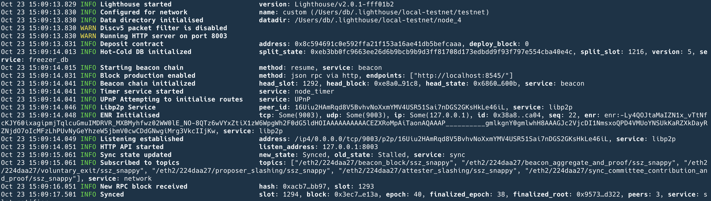
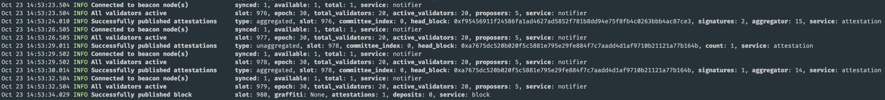
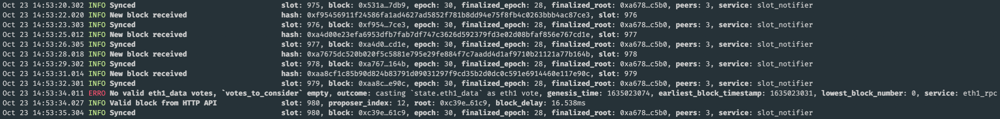

# Prototype -- Lighthouse Beacon Chain Light Client

The goal of this project is to create a very basic beacon chain light client prototype using [Sigma Prime's Lighthouse](https://github.com/sigp/lighthouse) implementation.

## Lighthouse Serenity Client

The following section walks through the Lighthouse codebase to better understand how everything interacts.

### Structure

The `lighthouse` directory is the entry point for the Lighthouse client build and uses a variety of dependencies from its siblings, described later.

```python
├── account_manager
├── beacon_node
├── boot_node
├── common
├── consensus
├── crypto
├── lcli
├── lighthouse
├── scripts
├── slasher
├── target
├── testing
└── validator_client
```

- [`account_manager`](https://github.com/sigp/lighthouse/tree/stable/account_manager) ⇒ stand-alone binary which allows users to generate and manage the cryptographic keys necessary to interact with Ethereum Serenity
  - Generates cryptographic keypairs, stores private keys, and produces messages/txs to stake with Eth1 deposit contract
  - Can use `./account_manager generate` command to generate new private key, or (for testing) a deterministic key with `./accounts_manager generate_deterministic -i <index>`
- [`beacon_node`](https://github.com/sigp/lighthouse/tree/stable/beacon_node) ⇒ build for a full beacon node
  - Everything from networking to syncing to state processing to API support
- [`boot_node`](https://github.com/sigp/lighthouse/tree/stable/boot_node) ⇒ initiates the discv5 bootnode process that assists nodes on the network to discover each other (e.g., uses both [`eth2_libp2p`](https://lighthouse-docs.sigmaprime.io/eth2_libp2p/index.html) & [`discv5`](https://github.com/ethereum/devp2p/blob/master/discv5/discv5.md))
  - Constructs a simple discv5 server
  - Generates ENR (e.g., UDP port, IP port, node ID, etc.) from a local config (using `boot_node`'s CLI), which is part of the bootstrapping process
- [`common`](https://github.com/sigp/lighthouse/tree/stable/common) ⇒ a group of common crates for Eth2-specific logic
- [`consensus`](https://github.com/sigp/lighthouse/tree/stable/consensus) ⇒ implements the beacon chain Altair [consensus specifications](https://github.com/ethereum/consensus-specs/) (described in more detail below)
  - [state processing](https://github.com/sigp/lighthouse/tree/stable/consensus/state_processing/src) (block, slot, epoch), [shuffling](https://github.com/sigp/lighthouse/tree/stable/consensus/swap_or_not_shuffle/src) (validator committees, proposer), [LMD GHOST](https://github.com/sigp/lighthouse/tree/stable/consensus/fork_choice/src), [SSZ](https://github.com/sigp/lighthouse/tree/stable/consensus/ssz/src), [object types](https://github.com/sigp/lighthouse/tree/stable/consensus/types/src) (blocks, attestations,...), etc.
- [`crypto`](https://github.com/sigp/lighthouse/tree/stable/crypto) ⇒ cryptography, e.g., [BLS](https://github.com/sigp/lighthouse/tree/stable/crypto/bls/src), [hashing](https://github.com/sigp/lighthouse/blob/stable/crypto/eth2_hashing/src/lib.rs), etc.
- [`lcli`](https://github.com/sigp/lighthouse/tree/stable/lcli) ⇒ command-line debugging tools (e.g., used with local testnet), allowing for replaying state transitions from SSZ files to assist in fault-finding
- [`lighthouse`](https://github.com/sigp/lighthouse/blob/stable/lighthouse/src/main.rs) ⇒ build the Lighthouse client based on CLI interactions for beacon node, validator client, etc.
- [`scripts`](https://github.com/sigp/lighthouse/tree/stable/scripts) ⇒ provides some useful scripts, such as [local testnet](https://github.com/sigp/lighthouse/tree/stable/scripts/local_testnet) setup
- [`slasher`](https://github.com/sigp/lighthouse/tree/stable/slasher) ⇒ used for proposing validator slashing and broadcasting the [proposed indexed attestations](https://github.com/sigp/lighthouse/blob/stable/slasher/src/attestation_queue.rs)
- [`testing`](https://github.com/sigp/lighthouse/tree/stable/testing) ⇒ self-explanatory
- [`validator_client`](https://github.com/sigp/lighthouse/tree/stable/validator_client/src) ⇒ implements a validator client, such as validator duties (attesting, producing, sync), signing, etc.

### Local Testnet Setup

- Instructions: [here](https://github.com/sigp/lighthouse/tree/unstable/scripts/local_testnet)
- `cd` to `scripts/local_testnet/`, edit params (e.g., # beacon nodes and clients to emulate)
- Within this directory, run `./start_local_testnet.sh` ⇒ however, ran into issues with this script...
- To manually produce `./start_local_testnet.sh`, run the following:
  - `./ganache_test_node.sh` ⇒ sets up local Ganache Eth1 instance with params from `./vars.env`
  - `./setup.sh` ⇒ deploys Eth1 deposit contract (0x8c594691c0e592ffa21f153a16ae41db5befcaaa) onto Ganache testnet
    - Saves `$DATADIR` as `$HOME/.lighthouse/` & creats a `local-testnet` child directory, containing all testnet data (config, nodes, validators, etc.)
    - Specified number of validators & beacon nodes in `./vars.env` are created
      - i.e., `N` nodes created as directories `node_1`, `node_2`, etc. where validators are allocated to nodes and validator secrets/info are stored
    - `testnet` directory created with genesis & saves basic config info to `config.yaml` (e.g., blocks per slot, chain ID, fork, deposit contract address, etc.)
      - also contains `boot_enr.yaml` (initially empty), `deploy_block.txt` , and `genesis.ssz`
    - Note that `./reset_genesis_time.sh` resets the genesis state/time, which may be required if it's been awhile since `./setup.sh` was ran (e.g., causing issues with skipped slots)
  - `./bootnode.sh` ⇒ generates bootnode ENR to enable local node discovery via discv5
    - creates `bootnode` directory, containing record `enr.dat` in which it writes this ENR to `testnet/boot_enr.yaml`
  - `./beacon_node.sh <DATADIR> <NETWORK-PORT> <HTTP-PORT> <OPTIONAL-DEBUG-LEVEL>` ⇒ starts a specific beacon node, created via `./setup.sh`
    - e.g., `./beacon_node.sh $HOME/.lighthouse/local-testnet/node_1 9000 8000` and repeat for different nodes/ports to connect peers
    - Multiple things will occur here, including initializing ENR, API requests, downloading beacon state, and starting up libp2p to continually discover peers
    - Note that errors will occur if the beacon node is not fully "synced" — this requires running multiple nodes (and also run validators per node, below)
    - Here's an example output of what should be produced:
      
  - `./validator_client.sh <DATADIR> <BEACON-NODE-HTTP> <OPTIONAL-DEBUG-LEVEL>` ⇒ starts a validator client that attaches to the running beacon node
    - e.g., `./validator_client.sh $HOME/.lighthouse/local-testnet/node_1[http://localhost:8000](http://localhost:8000/)`
    - The validator will begin to make API requests (e.g., downloading attesters) to the beacon node at the specified http address
    - Example view from a validator
  - At this point, the mining process will successfully occur in which validators are attesting & nodes are mining on the local testnet
  - If a new testnet is needed (and these steps are followed instead of `./start_local_testnet.sh`), run `./clean.sh`
- The following are views from both a validator client running on a beacon node and the beacon node's view of the same slots (using 4 total nodes & 80 validators, aka 20 per node)

  |  |
  | :--------------------------------------------------------------: |
  |              |
  |           Validator client & beacon node, respectively           |

### Making API Requests

- When starting up a beacon node on the local testnet, each node has a port specified to serve HTTP request consistent with beacon chain specs defined [here](https://ethereum.github.io/beacon-APIs/)
- Use the command line to query `node_1` on port `8000` — e.g., the beacon chain canonical header:

  ```python
  curl -X GET "http://localhost:8000/eth/v1/beacon/headers/head" -H  "accept: application/json"

  {
      "data": {
          "root": "0xee9a89ba7e3fd7b980b31deabdd0ebf4af425928fc5075b47e2c6624257e2f6d",
          "canonical": true,
          "header": {
              "message": {
                  "slot": "1419",
                  "proposer_index": "59",
                  "parent_root": "0x59bb681390ced5781f241aba221add4ab1f10b71fb9822c2acb4f66eac7ed2b8",
                  "state_root": "0x14836b9386d86ebff33bea841d205fb7b87d75ff306a58fccf85792a4f4db93c",
                  "body_root": "0xa959eae699160117b347ce5a92c15025aa6ebc558605465fcaae79ac538a156f"
              },
              "signature": "0xadf07676efc95a3132fc816af74759e83243a894b6c02f36510e2636fa4d0c9a18b2b928a30893553fcb81f9e67a833102eecafbcb11e1c5596d58f4fd34e3fa7277d36677a0735ab55c8713ae65e66a311bf28ffce17e30c42112f192133b77"
          }
      }
  }
  ```

  - Note that CORS is enabled by default in a local testnet environment, so it's possible to simply append queries to the `localhost` URL in the browser
    - e.g., `localhost:8000/eth/v1/beacon/headers/head`

## Light Client Design

The following section touches on useful aspects from both the Lighthouse Serenity client & ChainSafe's Lodestar to help prototype a minimal light client.

### Potentially Useful Parts from the Lighthouse Codebase

The following could be potentially used in or relevant to building a minimal light client implementation.

- [`beacon_node`](https://github.com/sigp/lighthouse/tree/stable/beacon_node)
  - [`http_api/src/sync_committees.rs`](https://github.com/sigp/lighthouse/blob/stable/beacon_node/http_api/src/sync_committees.rs) ⇒ sync committee duties, signatures, proofs
  - [`http_api/src/state_id.rs`](https://github.com/sigp/lighthouse/blob/stable/beacon_node/http_api/src/state_id.rs)` ⇒ get beacon chain's state at certain slot
  - [`http_api/src/block_id.rs`](https://github.com/sigp/lighthouse/blob/stable/beacon_node/http_api/src/block_id.rs)` ⇒ get block at certain index
  - [`network/src/sync`](https://github.com/sigp/lighthouse/tree/stable/beacon_node/network/src/sync) ⇒ backfill & range syncing
  - [`network/src/beacon_processesor/worker`](https://github.com/sigp/lighthouse/tree/stable/beacon_node/network/src/beacon_processor/worker) ⇒ gossip, RPC, & sync methods
  - [`eth2_libp2p/rpc/src/methods.rs`](https://github.com/sigp/lighthouse/blob/stable/beacon_node/eth2_libp2p/src/rpc/methods.rs) ⇒ JSON RPC methods
- [`consensus`](https://github.com/sigp/lighthouse/tree/stable/consensus) ⇒ primary repo to borrow design from
  - [`types`](https://github.com/sigp/lighthouse/tree/stable/consensus/types/src)
    - [`beacon_block_header.rs`](https://github.com/sigp/lighthouse/blob/stable/consensus/types/src/beacon_block_header.rs)
    - [`signed_beacon_block_header.rs`](https://github.com/sigp/lighthouse/blob/stable/consensus/types/src/signed_beacon_block_header.rs)
    - [`beacon_state.rs`](https://github.com/sigp/lighthouse/blob/stable/consensus/types/src/beacon_state.rs)
    - [`sync_committee.rs`](https://github.com/sigp/lighthouse/blob/stable/consensus/types/src/sync_committee.rs)
    - [`sync_committee_subscription.rs`](https://github.com/sigp/lighthouse/blob/stable/consensus/types/src/sync_committee_subscription.rs)
    - [`sync_aggregate.rs`](https://github.com/sigp/lighthouse/blob/stable/consensus/types/src/sync_aggregate.rs)
    - [`signed_contribution_and_proof.rs`](https://github.com/sigp/lighthouse/blob/stable/consensus/types/src/signed_contribution_and_proof.rs)
    - [`validator.rs`](https://github.com/sigp/lighthouse/blob/stable/consensus/types/src/validator.rs)
    - [`checkpoint.rs`](https://github.com/sigp/lighthouse/blob/stable/consensus/types/src/checkpoint.rs)
  - [`ssz`](https://github.com/sigp/lighthouse/tree/stable/consensus/ssz)
  - [`state_processing/per_epoch_processing`](https://github.com/sigp/lighthouse/tree/stable/consensus/state_processing/src/per_epoch_processing)
  - [`tree_hash`](https://github.com/sigp/lighthouse/tree/stable/consensus/tree_hash/src)
  - [`merkle_proof`](https://github.com/sigp/lighthouse/tree/stable/consensus/merkle_proof/src)
- [`crypto`](https://github.com/sigp/lighthouse/tree/stable/crypto)
  - [`bls/src/generic_signature_set.rs`](https://github.com/sigp/lighthouse/blob/stable/crypto/bls/src/generic_signature_set.rs) ⇒ makes it easier to interact with signature verification in groups, which uses:
    - [`bls/src/generic_public_key.rs`](https://github.com/sigp/lighthouse/blob/stable/crypto/bls/src/generic_public_key.rs) ⇒ individual validator public key
    - [`bls/src/generic_signature.rs`](https://github.com/sigp/lighthouse/blob/stable/crypto/bls/src/generic_signature.rs) ⇒ individual validator signature
    - [`bls/src/generic_aggregate_public_key.rs`](https://github.com/sigp/lighthouse/blob/stable/crypto/bls/src/generic_aggregate_public_key.rs) ⇒ aggregating public keys from sync committee
    - [`bls/src/generic_aggregate_signature.rs`](https://github.com/sigp/lighthouse/blob/stable/crypto/bls/src/generic_aggregate_signature.rs) ⇒ aggregating sync committee signatures
  - [`bls/eth2_hashing/src/lib.rs`](https://github.com/sigp/lighthouse/blob/stable/crypto/eth2_hashing/src/lib.rs) ⇒ implements SHA256, optimized for Eth2
- [`lcli`](https://github.com/sigp/lighthouse/tree/stable/lcli/src) ⇒ in general, a lot of useful functions that can be used when testing light client responses to beacon chain behavior
- [`scripts`](https://github.com/sigp/lighthouse/tree/stable/scripts)
  - [`local_testnet`](https://github.com/sigp/lighthouse/tree/stable/scripts/local_testnet) ⇒ many described in the Local Testnet Setup section (e.g., starting the [testnet](https://github.com/sigp/lighthouse/blob/stable/scripts/local_testnet/start_local_testnet.sh), [bootnode](https://github.com/sigp/lighthouse/blob/stable/scripts/local_testnet/bootnode.sh), etc.)
- [`testing`](https://github.com/sigp/lighthouse/tree/stable/testing)
  - [`ef_tests`](https://github.com/sigp/lighthouse/tree/stable/testing/ef_tests) ⇒ tests defined in the [consensus specs](https://github.com/ethereum/consensus-spec-tests)
  - [`simulator/src/main.rs`](https://github.com/sigp/lighthouse/blob/stable/testing/simulator/src/main.rs) ⇒ runs a simulation that creates `N` beacon node and `v` validator clients per node
  - [`simulator/src/sync_sim.rs`](https://github.com/sigp/lighthouse/blob/stable/testing/simulator/src/sync_sim.rs) ⇒ syncing simulation
  - [`state_transition_vectors`](https://github.com/sigp/lighthouse/tree/stable/testing/state_transition_vectors) ⇒ creates the test vectors for use cases like valid epoch or invalid signatures
  - [`web3_signer_tests/src/lib.rs`](https://github.com/sigp/lighthouse/blob/stable/testing/web3signer_tests/src/lib.rs) ⇒ tests between the Lighthouse `ValidatorStore` and [Web3Signer HTTP API](https://docs.eth2signer.consensys.net/en/latest/Reference/Rest/) (e.g., `SignedAggregateAndProof` or `SyncSelectionProof`)
- [`validator_client`](https://github.com/sigp/lighthouse/tree/stable/validator_client/src)
  - [`src/sync_committee_service.rs`](https://github.com/sigp/lighthouse/blob/stable/validator_client/src/sync_committee_service.rs)` ⇒ used by validators for publishing sync committee signatures & aggregates as well as managing associated subscriptions
  - [`src/check_synced.rs`](https://github.com/sigp/lighthouse/blob/stable/validator_client/src/check_synced.rs) ⇒ check if the beacon node that's being connected to is fully synced
  - [`src/duties_service.rs`](https://github.com/sigp/lighthouse/blob/stable/validator_client/src/duties_service.rs) ⇒ check validators duties against all local validators, polling beacon node at regular intervals
  - [`src/signing_method/web3signer.rs`](https://github.com/sigp/lighthouse/blob/stable/validator_client/src/signing_method/web3signer.rs) ⇒ used in making requests to HTTP API Web3Signer servers (e.g., `SyncCommitteeSelectionProof`)

### Lodestar's Minimal Light Client

In creating a Lighthouse minimal light client, it's helpful to note how [ChainSafe's Lodestar light client](https://github.com/ChainSafe/lodestar/tree/master/packages/light-client) is architected, which has the following structure:

```python
├── client
│   ├── events.ts
│   ├── index.ts
│   ├── types.ts
│   ├── update.ts
│   └── validation.ts
├── server
│   ├── LightClientUpdater.ts
│   ├── index.ts
│   └── utils.ts
└── utils
    ├── chunkify.ts
    ├── clock.ts
    ├── syncPeriod.ts
    ├── utils.ts
    └── verifyMerkleBranch.ts
```

- [`client`](https://github.com/ChainSafe/lodestar/tree/master/packages/light-client/src/client) ⇒ implementation of a light client — instantiation, API calls to beacon nodes, & processing sync updates where persistance is handled by the `server`

  - [`events.ts`](https://github.com/ChainSafe/lodestar/blob/master/packages/light-client/src/client/events.ts) ⇒ emits events as a `LightclientEvent` for new block headers ([`BeaconBlockHeader`](https://github.com/ChainSafe/lodestar/blob/7bd7467b34f3b1bc6c541a901405b6711feb4205/packages/types/src/phase0/types.ts#L21)) and when a new sync period has begun & the sync committee has transitioned
    - Note -- existing types are defined in and imported from [@lodestar/types](https://github.com/ChainSafe/lodestar/tree/master/packages/types)
  - [`types.ts`](https://github.com/ChainSafe/lodestar/blob/master/packages/light-client/src/client/types.ts) ⇒ defines `LightClientStoreFast`, `LightClientSnapshotFast`, and `SyncCommitteeFast`; imports types defined in beacon chain [phase 0](https://github.com/ChainSafe/lodestar/tree/master/packages/types/src/phase0) and [Altair](https://github.com/ChainSafe/lodestar/tree/master/packages/types/src/altair)
    - `LightClientStoreFast` ⇒ contains a light client's latest snapshot and potential/"best" updates
    - `LightClientSnapshotFast` ⇒ contains the beacon chain header snapshot as well as current & next sync committee
    - `SyncCommitteeFast` ⇒ contains the pubkeys and aggregated pubkeys of the sync committee
  - [`update.ts`](https://github.com/ChainSafe/lodestar/blob/master/packages/light-client/src/client/update.ts) ⇒ defines the syncing process & updates the store (and has some very descriptive documentation, included below)

    - At a minimum, nodes should keep the latest header at a specific period or even just the latest period (if very light)
    - Sync types:

      - Committee ⇒ retrieve all `SyncCommittee` pubkeys for a given period
        - Retrieve the sync committee of each period b/w its latest trusted period up to the target checkpoint
          - doesn't care about the slot of the update as long as at least one per period
        - Query
          ```python
          GET /eth/v1/lightclient/best-update/:periods
          ```
      - Head ⇒ query state beyond the latest finalized checkpoint

        - Requires using a known `SyncCommittee` such that the light client can request headers in period `N` signed by a known `SyncCommittee`
        - Query

          ```python
          GET /eth/v1/lightclient/latest-header/:period

          {
          	header: phase0.BeaconBlockHeader;
          	syncCommitteeBits: BitVector;
          	syncCommitteeSignature: primitive.BLSSignature;
          	forkVersion: primitive.Version;
          }
          ```

    - Sync process:
      1. Start from a trusted state root; if the light client has an existing store, jump to 3
      2. Request a proof for `CurrentSyncCommittee` and `NextSyncCommittee` at the trusted state root & sync from `computePeriodAtSlot(trustedSlot)`
      3. Compute the list of sequential periods between the trusted state root and the clock = periods
         - Query: `GET /eth/v1/lightclient/best-update/{periods}`
           - Recall — the "best update" for a light client is to persist the latest update that has the most sync committee signatures (bits) within a period
      4. Verify and apply each update sequentially
      5. At the end of each clock period, jump to 3 and repeat
    - Functions
      - `processLightClientUpdate` ⇒ maintains light client state in a store object of type `LightClientStore`
        - Every update triggers `processLightClientUpdate(store, update, currentSlot, genesisValidatorsRoot)` where `currentSlot` is the current slot based on some local clock
        - Basically, validates the sync period of the new update, get its current slot's period to then it compare it to the existing best update of that period → once there's a best update with at least 2/3 quorum & finality proof, the best update is overwritten as the snapshot
      - `applyLightClientUpdate` ⇒ called by the processing function & updates the `LightClientSnapshot` with a new header & committees for the
      - Also has helper function `isBetterUpdate` for simply comparing existing & new updates for the greater `SyncCommitteeBits`

  - [`validation.ts`](https://github.com/ChainSafe/lodestar/blob/master/packages/light-client/src/client/update.ts) ⇒ verifies update: no sync period skips, finalization root, new sync committee, aggregate signatures
    - Note — differs from the spec in that an update with the same `header.slot` can be valid and valuable to the light client (spec only allows snapshot to be updated once per period, but this allows for new update to overwrite the snapshot if it has more sync committee signatures)
  - [`index.ts`](https://github.com/ChainSafe/lodestar/blob/master/packages/light-client/src/client/index.ts) ⇒ creates the light client & calls API to beacon chain node where logic above is applied on returned data

- [`server`](https://github.com/ChainSafe/lodestar/tree/master/packages/light-client/src/server) ⇒ persistence for the light client via key-value store
  - [`LightClientUpdater.ts`](https://github.com/ChainSafe/lodestar/blob/master/packages/light-client/src/server/LightClientUpdater.ts) ⇒ computes & caches `LightClientUpdate` objects as the chain advances
  - [`utlis.ts`](https://github.com/ChainSafe/lodestar/blob/master/packages/light-client/src/server/utils.ts)` ⇒ helper functions for determining "best" sync committee's updates (i.e., based on cumulative signatures) and "official" finalization
  - `index.ts` ⇒ simply exports siblings
- [`utils`](https://github.com/ChainSafe/lodestar/tree/master/packages/light-client/src/utils)
  - [`syncPeriod.ts`](https://github.com/ChainSafe/lodestar/blob/master/packages/light-client/src/utils/syncPeriod.ts) ⇒ functions to return the epoch number at a given slot or sync committee period at a given slot/epoch
  - [`utils.ts`](https://github.com/ChainSafe/lodestar/blob/master/packages/light-client/src/utils/utils.ts) ⇒ potentially useful utils in case Lighthouse does not implement similar items
  - [`verifyMerkleBranch.ts`](https://github.com/ChainSafe/lodestar/blob/master/packages/light-client/src/utils/verifyMerkleBranch.ts) ⇒ obviously, verifies a Merkle branch (taking leaf, proof, depth, index, and root) and imports ChainSafe's [persistent Merkle tree](https://github.com/ChainSafe/persistent-merkle-tree)
- [`test`](https://github.com/ChainSafe/lodestar/tree/master/packages/light-client/test) ⇒ additional directory with test cases
  - [`lightclientMockServer.ts`](https://github.com/ChainSafe/lodestar/blob/master/packages/light-client/test/lightclientMockServer.ts) ⇒ could be helpful to reference

Additionally, under [`@lodestar/api`](https://github.com/ChainSafe/lodestar/tree/master/packages/api/src), relevant light client endpoints are established (and notes on general serialization process [here](https://github.com/ChainSafe/lodestar/blob/aafc5d71f4623c56186d90b0b2004ce6866c02ad/packages/api/src/routes/index.ts#L13), also defined below)

```python
├── client
├── routes
├── server
├── utils
├── index.ts
└── interface.ts
```

- [`client/lightclient.ts`](https://github.com/ChainSafe/lodestar/blob/master/packages/api/src/client/lightclient.ts) ⇒ establishes REST HTTP client for light client routes
  - `getClient` ⇒ returns JSON or binary as an `Api` object (defined below):
    - `getStateRoot` & `getInitProof` are uniquely defined here as they don't return JSON but binary, so need custom logic
- [`server/lightclient.ts`](https://github.com/ChainSafe/lodestar/blob/master/packages/api/src/server/lightclient.ts) ⇒ handles requests from the client
  - `getStateRoot` & `getInitProof` ⇒ return data as serialized binary (`Content-Type: application/octet-stream`) instead of JSON, hence, why uniquely defined
- [`routes/lightclient.ts`](https://github.com/ChainSafe/lodestar/blob/master/packages/api/src/routes/lightclient.ts) ⇒ endpoints abiding to [Beacon Node HTTP API specs](https://ethereum.github.io/beacon-APIs/) & used in [`client/lightclient.ts`](https://github.com/ChainSafe/lodestar/blob/master/packages/api/src/client/lightclient.ts)
  - `Api` ⇒ establishes the following methods:
    - `getStateRoot` (taking the `stateId` & `paths`) ⇒ returns deserialized state proof (Merkle tree)
    - `getInitProof` (taking the desired block root) ⇒ returns deserialized proof
    - `getBestUpdates` (takes from & to `SyncPeriod`) ⇒ returns array of `LightClientUpdate`
    - `getLatestUpdateFinalized` ⇒ returns a `LightClientUpdate`
    - `getLatestUpdateNonFinalized` ⇒ returns a `LightClientUpdate`
  - routes (which use `ssz` accordingly)
    - `getStateRoot` ⇒ `/eth/v1/lightclient/proof/:stateId` (POST)
    - `getInitProof` ⇒ `/eth/v1/lightclient/init_proof/:blockRoot` (GET)
    - `getBestUpdates` ⇒ `/eth/v1/lightclient/best_updates` (GET)
    - `getLatestUpdateFinalized` ⇒ `/eth/v1/lightclient/latest_update_finalized` (GET)
    - `getLatestUpdateNonFinalized` ⇒ `/eth/v1/lightclient/latest_update_nonfinalized` (GET)
- In terms of serialization, Lodestar using the following design in handling an HTTP request to the Lodestar BeaconNode API:
  1. Serialize request: api args => req params
     (--- wire)
  2. Deserialize request: req params => api args
     (--- exec api)
  3. Serialize api _return_ => res body
     (--- wire)
  4. Deserialize res body => api _return_

## Lighthouse Minimal Light Client Implementation

The Lighthouse project is forked where development will take place in the following repo: [here](https://github.com/buchhlz2/lighthouse) (WIP, only local & nothing yet)

### Project Setup

1. Fork [Lighthouse](https://github.com/sigp/lighthouse) into personal repo & clone locally
2. Create `beacon_chain_light_client` crate: `cargo new beacon_chain_light_client`
3. Add the `beacon_chain_light_client` (and subsequent libraries/crates created in the directory) to the overall workspace
   1. Under root's `Cargo.toml`, insert `beacon_chain_light_client` into the _[workspace]_ `members` array
   2. Ensures successful compilation by avoiding _invalid workspace configuration_ error

### Design Steps (WIP)

1. Add dependencies to `beacon_chain_light_client`'s `Cargo.toml`
   1. Cross-reference what other packages (e.g., `lighthouse`, `validator_client`, etc.) are dependent on
   2. Note — `consensus` directory has useful consensus-related Phase 0 & Altair types, functions, and constants (under `presets`)
2. Create `light_client` crate (resembling the Lodestar light client's `client` setup) with the following:
   1. `events.rs` ⇒ emits event upon new headers or updates in the light client's sync committee
      1. Create event object (with consensus type dependencies listed below it)
         1. `LightClientEvents`
            1. `BeaconBlockHeader`
            2. `SyncPeriod` (to be created in `light_client_types.rs`)
   2. `light_client_types.rs` ⇒ defines new types needed for a light client
      1. Create new types (with consensus type dependencies listed below it)
         1. `SyncPeriod` ⇒ a `u64`, used for readability purposes (potentially, just add to the `consensus/types` of `slot_epoch.rs`)
         2. `LightClientSnapshot`
            1. `BeaconBlockHeader`
            2. `SyncCommittee`
         3. `LightClientUpdate`
            1. `BeaconBlockHeader` (for primary header & finality header)
            2. `SyncCommittee` (for defining next sync committee)
            3. `FixedVector` (for finality & next sync committee branches) ⇒ specifically, `FixedVector<Hash256, T::SIZE_OF_VECTOR>`
            4. `BitVector` (for sync committee aggregate signature) ⇒ specifically, `BitVector<T::COMMITTEE_SIZE>`
            5. `AggregateSignature` (for sync committee signature) ⇒ from `crypto/bls`
            6. `Fork` (versioning)
         4. `LightClientStore`
            1. `LightClientSnapshot`
            2. `LightClientUpdate`
   3. `light_client_update.rs`
      1. Create function to process light client updates upon receiving a `LightClientUpdate` and then overwrite store accordingly
         1. `process_light_client_update.rs`
            1. Uses `validate_light_client_update.rs` sibling crate to check valid light client update
            2. Uses `apply_light_client_update.rs` & updates the store accordingly
         2. Params/type dependencies
            1. `LightClientStore`
            2. `LightClientUpdate`
            3. `Slot`
            4. `Root` ⇒ just a `Hash256`
               1. Note: `common/eth2` defines the `genesis_validators_root` as part of `GenesisData` struct
      2. Create function to update the latest snapshot
         1. `apply_light_client_update.rs`
         2. Params/type dependencies
            1. `LightClientSnapshot`
            2. `LightClientUpdate`
      3. Optional — create helper function for comparing two updates for which is "better"
         1. `is_better_update.rs` ⇒ returns boolean
         2. Params/type dependencies
            1. `LightClientUpdate`
   4. `validate_light_client_update.rs`
      1. Create validation function for a `LightClientUpdate`
         1. `validate_light_client_update.rs`
         2. Params/type dependencies
            1. `LightClientSnapshot`
            2. `LightClientUpdate`
            3. `Root` ⇒ `Hash256` (the genesis validator's root)
   5. TO DO: `lib.rs`
      1. Makes API calls to a beacon node to then run through the light client accordingly
      2. Import siblings: `light_client_types.rs`, `events.rs`, `light_client_update.rs`, `validate_light_client_updates.rs`
      3. Create `LightClient` container
         1. TO DO: continue spec-ing

---

### Sources

- [Sigma Prime Lighthouse Book](https://lighthouse-book.sigmaprime.io/api-bn.html)
- [Lighthouse repo](https://github.com/sigp/lighthouse)
