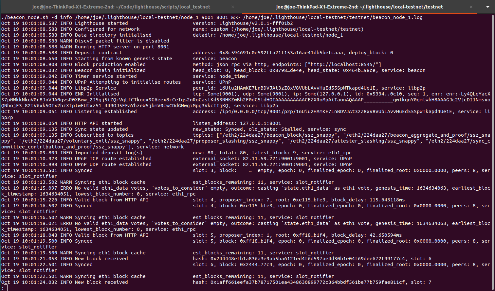

## Lighthouse

### running on local ganache instance wih defaults

Lighthouse offers the option to run beacon nodes and validators on top of ganache (providing a simulated execution layer). This is really useful as a "disposable" local blockchain for developing on before even running on a public testnet. To run the local testnet "out-the-box", first fork a private copy of the lighthouse repo and clone it locally. Then:

```
cd home/user/Code/lighthouse/scripts/local_testnet
make
make install-lcli
./start_local_testnet.sh

```
This builds the client software, configures and starts the Lighthouse stack using default configurations. `htop`shows the various processes relating to the local execution layer, beacon nodes and validators hard at work. However, apart from the cpu and memory usage the processes are invisible - there are no logs printed to the console at all, just a single notice informing you that the local testnet has started. This is because ther are multiple Beacon nodes and multiple validators running simultaneously - printing all the relevant logs to the console would just be an intractable mess. Instead, the logs for each node/validator are saved to disk. To stop the validator and check the logs:

```
./stop_local_testnet.sh

cd /home/joe/.lighthouse/local-testnet/testnet/
sudo less beacon_node_X.log

```

Alternatively, run `tail -f home/user/.lighthouse/local-testnet/testnet/beacon_node_x.log` to view beacon node 1's logs while the testnet is running.

This displays node 1's logs to the console. Scrolling through the logs will show the initial chain syncing, then sequential acknowledgement and processing of new blocks once the Beacon node has found the head of the chain.

<br></br>

<br></br>

Now you are free to hack away at the source code and test it locally, with the results available in the logs.


## HTTP request sto the Beacon Nodes

The Beacon nodes serve http request saccording to the Altair consensus specs.

With a local testnet running, a separate terminal can use curl to request data from the Beacon node:

```
curl -X GET "http://localhost:8005/eth/v1/beacon/headers/head"

```

returns

```
{"data":
  {"root":"0x700e84a19e298ee6be197d991e666d5aeb3b9dcf0c2f2fde44af8ff6bc052717",
  "canonical":true,
  "header":{
      "message":{
          "slot":"75",
          "proposer_index":"44", 
          "parent_root":"0x6adf46981eed5381e6...",
          "state_root":"0x4dcef08aabcbbfd3e10...",
          "body_root":"0x44cfdf8c6b8dd323e7d4..."},
          "signature":"0x8efac02d9ce20084d890..."
      }
    }
 }

```

The beacon node exposes the http endpoints at specific ports defined on startup. In `start_local_testnet.sh` there is a loop that assigns the http port in a loop. Starting from the base port (default is 8000), each node i that starts up serves http requests on port base_port+i, e.g. node 1 = port 8001, node 2 = port 8002 etc. So to query information about the validator associated to node 9:

```
curl -X GET "http://localhost:8009/eth/v1/beacon/states/head/validators/1" -H  "accept: application/json"

```
which returns

```
{"data":{
    "index":"1",
    "balance":"32011428000",
    "status":"active_ongoing",
    "validator":{
        "pubkey":"0xb89bebc699769726a318c8...",
        "withdrawal_credentials":"0x00ec7ef7780c9d15159...",
        "effective_balance":"32000000000",
        "slashed":false,
        "activation_eligibility_epoch":"0",
        "activation_epoch":"0",
        "exit_epoch":"18446744073709551615",
        "withdrawable_epoch":"18446744073709551615"
        }
    }
}

```

To access the state root of a specific block:

```
curl -X GET "http://localhost:8008/eth/v1/beacon/states/"finalized"/root"

```
which returns

```
{"data":{
    "root":"0xcdc94be86c7c8f9f1a68e..."
    }
}

```
"finalized" can be replaced with "justified", "genesis" or a specific block number.

The specification for all the API endpoints served by the Beacon node are [here](https://ethereum.github.io/beacon-APIs/#/Beacon/getStateRoot).

# Scratch Notes

- light client should connect to a node
- light client should grab the state root and sig from the latest finalized block
- light client should listen for new blocks arriving from node
- light client should validate the new block using block header info
- light client should query the node for specific info on user request
- light client should store minimum chain data (only back to finalized checkpoint)


Act 1: local Ganache blockchain
phase 1: trust node to provide valid data
phase 2: validate node data independently
phase 3: randomize node light client connects to
phase 4: rewrite in rust to integrate into Lighthouse source

Act 2: migrate to public testnet
phase 1: migrate as is
phase 2: get data from gossip rather than req/resp
phase 3: 