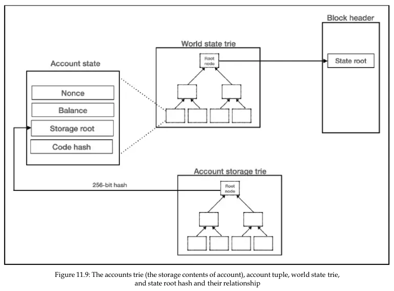

# Ethereum Witness Review (November 2021)

This article provides an overview of witnesses and the role they play in stateless Ethereum. It examines the current state of witness-related initiatives, and their overall projected use in the Ethereum protocol. It aims to provide a comprehensive review of the topic without straying into client-specific implementation details. As the protocol has not migrated to Verkle trees yet for storage, this document stops short of discussing how Verkle witnesses would look and operate. Rather, it concentrates on the Merkle tree versions that are currently available, the interplay with the concept of access lists, and some potential improvements and applications that do not require Verkle trees to be finished.

### What is a witness? A witness proof?
The term "witness" in mathematics or cryptography refers to a piece of information that enables the verification of some statement. As a basic example, consider a value `y`, a one way hashing function `HASH()`, and a witness `x`. We can easily check the truth of the statement `y = HASH(x)` by evaluating the right hand side and comparing to the left. Here, `x` is the witness, and `HASH()` acts as a sort of verification function.

In the context of Ethereum and particularly statelessness, the witness has a more specific definition. It commonly refers to sections of a Merkle (or other) tree that will allow us to answer the question of whether a certain value exists in this tree. In this scenario, the witness (set of hashes from the state tree) acts as "evidence" of the values. The verifier is an algorithm or other computation that performs some operations on the witness and concludes whether or not the value it is concerned with can exist in this tree.

### What is a witness in the context of Ethereum?
We know that we can think of Ethereum as a state machine. Each client stores a copy of the global (world) state as a Merkle Tree. When a block is processed for execution and validation, account information in the state tree is written and read according to the transactions in the block.

The objective of stateless Ethereum is for the client to no longer be forced to store the entire state tree. Instead, it just stores the state root - the root hash of the global state tree. However, we notice that there is a problem. How can the client process blocks, without a copy of the state tree to access and modify?

This is where the witness comes in. If the witness contains hashes and values from relevant points in the state tree, and is provided to the client along with the state root and block, the client can use this to validate the block. For each transaction in the block, the witness acts as a database that can be updated. When all transactions have been executed, a new state root can be calculated from the updated values and the witness proofs. This state root can then be compared to the state root supplied in the block header, thus validating the block if it is genuine. 

This is the high-level idea behind stateless clients. The witnesses would be generated by the miners, sent along with the blocks, and nodes would download and validate these blocks against the accompanying witness.

### wit/0
The formal specification for block witnesses was published in early 2020, and the first version of the witness protocol, `wit/0` followed this. `wit/0` is a network protocol that will eventually allow witnesses to be sent between nodes. However, despite the name, `wit/0` does not provide actual witnesses as described in the specification. Instead, it exposes methods to retrieve a list of node hashes used by the block. This is commonly referred to as a meta-witness - metadata about the witness. Theoretically, if we require a full witness, we should be able to derive this from the witness metadata.

### What is a meta-witness? What does it look like? How would one generate a real witness from it?

Above is a high-level diagram of how state is currently stored in Ethereum. We will refer to this while trying to understand what is provided by the meta-witness, and how that differs from the formal witness specification.

The specification of the meta-witness in `wit/0` describes a response of the following format to the `getBlockWitnessHashes` message,

`[reqID: P, witnessHashes: [trieNodeHash: B_32, ...]]`

where the `witnessHashes` refer to a list of the tree node hashes that were read during execution/validation of the block. These hashes can include nodes from the account storage tree, the code hash (bytecode), account nodes read at various points during execution, as well as any nodes that needed to be read to generate the final state root.

In order to generate a real witness from this, we return to the formal specification. According to this, the first level of the block witness consists of a tuple of all witness trees. Each tree object must contain some metadata and a tree node (second level). Each tree node is then recursively defined, and can refer to one of four node types (branches, extension, leaf or hash). It starts to become clear that the full witness refers to more than just the hash of nodes - it is more like relevant subsections of the world state tree, complete with their code, storage and account information. This is confirmed by looking at the client implementations of `wit/0`, specifically descriptions that detail what the meta-witness does not include.

It was mentioned earlier that the meta-witness contains enough information for us to derive the full witness. As it is a list of node hashes that correspond to every node that was accessed during the block, then the node hashes would seem to be sufficient to look up the details of the full node, as long as a copy of the full state is available. In this way, the meta-witness acts as an iteration on the path to full witnesses, but as we are about to see, is of limited use to a client that does not hold the full state.

### How would block verification work for Merkle Tree (meta-)witnesses?
Now that the meta-witnesses are available to us, it might be useful to think about how a client could verify a block using just a meta-witness. It seems like the meta-witness hashes could be used to look up the actual account and code storage, or they could be used to populate a real witness on the client side, that is then used in place of the Merkle Tree database. The state root can then be recalculated and compared to the block header. Regardless, we see that meta-witnesses do not help much in terms of allowing a client to reduce the amount of state it holds.

Assuming we have a full witness for a block - that is, all of the tree nodes and storage that we need in order to validate and execute a block, and hashes that are required to recompute a state root - we see that verification of the block become much more straightforward. Everything that we need to execute transactions is available in the witness.

In both cases, the verifier for the witness is the hashing method used on the witness and hashes in order to recompute the state root. The witness proof is the parts of the state tree that the block needs in order to perform this hashing, and have a chance at computing the state root correctly.

### Block access lists as witness verifiers
In many discussions of `wit/0` and witness generation, access lists are mentioned. Access lists refer to lists of addresses and their storage slots that were accessed during a transaction. They can occur at the transaction level, or at the block level. A block-level access list is easily collated from transaction level lists and it (or a hash of the serialized object) can be included in the header of a block.

Is there a way for us to use access lists and meta-witnesses in order for us to mimic the verifier/block validation process above? It seems unnecessary, since the information in the access list should be derivable from a witness. However, this useful property of the access list could act as a way to verify the validity of the witness itself. If we have an access list available in a block header, and a witness published by a miner, we can use the relevant parts of the witness to construct a root that can be compared to the access list hash. In this way, we can guarantee that the published witness corresponds to the block it accompanies, and any nodes that publish incorrect witnesses can be excluded without having to process the entire block.

The main use case for `wit/0` at the moment is to assist with Beam (fast) sync clients. In brief, rather than having to download the entire state, the beam sync client first requests the meta-witness for a block. It then downloads each of the state trie nodes corresponding to the hashes. This happens quickly enough that the client can remain synced with the mainnet. However, there are concerns within the community that this use of meta-witnesses introduces potential attacks on these nodes. By providing incorrect hashes (perhaps relating to an irrelevant part of the tree) a malicious node could incapacitate one of these clients, as the client downloads nodes which are not relevant for the specific block it needs to verify. There is therefore some desire to have a construction in the block header that a meta-witness can be validated against.

### Conclusion
One of the major issues with Merkle proof witnesses is that they will be too large to reliably include with blocks. This is being solved with the introduction of Verkle trees, the proof and verification of which would be much smaller and more efficient. Work on performant implementations of the Verkle trees is already underway. Leaving the specifics of these types of  witnesses aside for a later post, it makes sense that much of the discussion around witnesses and how to iterate upon `wit/0` has been tabled until after the replacement of Merkle trees with Verkle. Still, it is worthwhile to understand the current status of the effort and to consider potential improvements to the witness protocol. It is entirely possible that witnesses and related constructs have other practical uses apart from their role in facilitating stateless clients.

### Links
https://en.wikipedia.org/wiki/Witness_(mathematics)
https://ethresear.ch/t/the-stateless-client-concept/172
https://vitalik.ca/files/misc_files/stateless_client_witnesses.pdf
https://github.com/ethereum/portal-network-specs/blob/change-goals-structure/witness.md
https://github.com/ethereum/devp2p/blob/master/caps/wit.md
https://github.com/ethereum/py-evm/pull/1917
Mastering Blockchain - Imran Bashir https://www.scribd.com/document/528927643/Mastering-blockchain-a-deep-Dive-into-Distributed-ledgers-consensus-protocols-smart-contracts-dapps-cryptocurrencies-ethereum-and-More-by-Imran-bashir
http://homepages.math.uic.edu/~jan/mcs260/langlists.pdf
https://notes.ethereum.org/-fJSOrnYQl-mqoWKpaTIsQ
https://notes.ethereum.org/Yn_mwNa2SeeQHnKsRgekKg